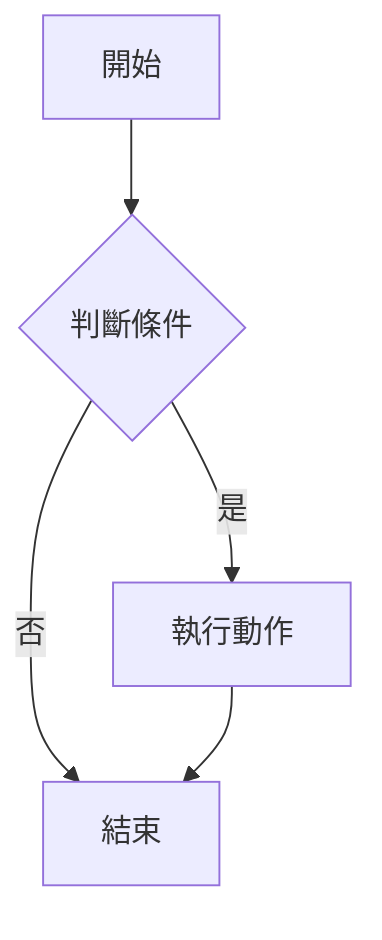
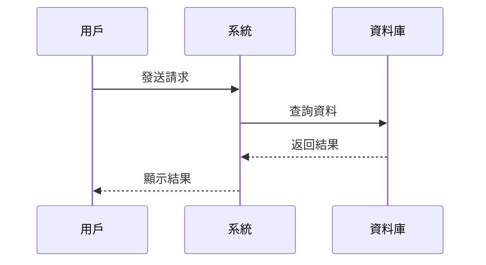
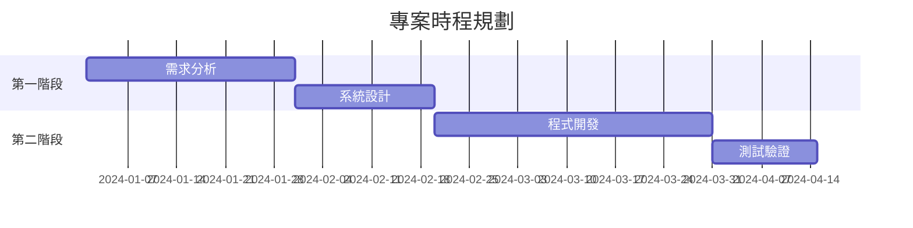
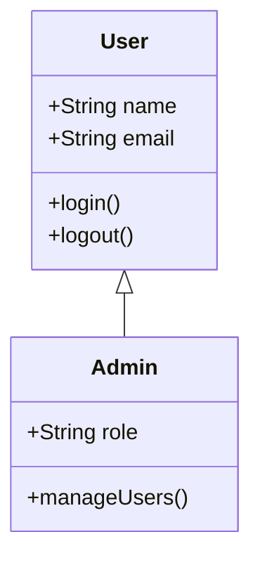
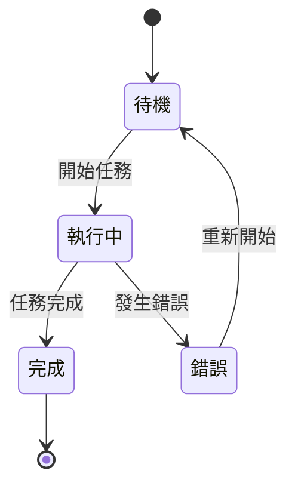

## 概述

本文詳細說明如何在 Hugo 部落格中實現 Mermaid 流程圖支援，包含：

- Mermaid.js 整合與初始化
- Markdown 語法轉換處理
- 自定義樣式設計
- 響應式圖表適配
- 多種圖表類型支援

## 1. 問題分析

### 1.1 Hugo Markdown 渲染問題

Hugo 的 Markdown 渲染器會將 Mermaid 程式碼區塊包裝在 `<pre><code>` 標籤中：

```html
<pre><code class="language-mermaid">
graph TD
    A[開始] --> B{判斷條件}
    B -->|是| C[執行動作]
    B -->|否| D[結束]
</code></pre>
```

但 Mermaid.js 需要的是 `<div class="mermaid">` 標籤：

```html
<div class="mermaid">
graph TD
    A[開始] --> B{判斷條件}
    B -->|是| C[執行動作]
    B -->|否| D[結束]
</div>
```

### 1.2 解決方案

使用 JavaScript 動態轉換 Markdown 渲染的程式碼區塊為 Mermaid 所需的格式。

## 2. 實現步驟

### 2.1 引入 Mermaid.js

在 `layouts/partials/custom_head.html` 中添加 Mermaid.js：



```html
<!-- Mermaid.js 支援 -->
<script src="https://cdn.jsdelivr.net/npm/mermaid@10.6.1/dist/mermaid.min.js"></script>
```



### 2.2 語法轉換腳本

添加 JavaScript 來轉換 Markdown 渲染的程式碼區塊：



```html
<!-- Mermaid 初始化與樣式 -->
<script>
  document.addEventListener('DOMContentLoaded', function() {
    // 轉換 mermaid 程式碼區塊
    const mermaidCodeBlocks = document.querySelectorAll('pre code.language-mermaid');
    mermaidCodeBlocks.forEach(function(block) {
      const pre = block.parentElement;
      const div = document.createElement('div');
      div.className = 'mermaid';
      div.textContent = block.textContent;
      pre.parentNode.replaceChild(div, pre);
    });
    
    // 初始化 Mermaid
    mermaid.initialize({
      startOnLoad: true,
      theme: 'default',
      securityLevel: 'loose',
      fontFamily: 'Arial, sans-serif',
      themeVariables: {
        primaryColor: '#2d3748',
        primaryTextColor: '#2d3748',
        primaryBorderColor: '#4a5568',
        lineColor: '#4a5568',
        secondaryColor: '#e2e8f0',
        tertiaryColor: '#f7fafc'
      }
    });
  });
</script>
```



### 2.3 自定義樣式

添加 Mermaid 圖表的 CSS 樣式：



```html
<style>
  /* Mermaid 圖表樣式 */
  .mermaid {
    text-align: center;
    margin: 20px 0;
  }
  
  .mermaid svg {
    max-width: 100%;
    height: auto;
  }
  
  /* 響應式設計 */
  @media (max-width: 768px) {
    .mermaid {
      font-size: 12px;
    }
  }
</style>
```



## 3. 完整實現程式碼

### 3.1 custom_head.html 完整程式碼



```html
<!-- Mermaid.js 支援 -->
<script src="https://cdn.jsdelivr.net/npm/mermaid@10.6.1/dist/mermaid.min.js"></script>

<!-- Mermaid 初始化與樣式 -->
<script>
  document.addEventListener('DOMContentLoaded', function() {
    // 轉換 mermaid 程式碼區塊
    const mermaidCodeBlocks = document.querySelectorAll('pre code.language-mermaid');
    mermaidCodeBlocks.forEach(function(block) {
      const pre = block.parentElement;
      const div = document.createElement('div');
      div.className = 'mermaid';
      div.textContent = block.textContent;
      pre.parentNode.replaceChild(div, pre);
    });
    
    // 初始化 Mermaid
    mermaid.initialize({
      startOnLoad: true,
      theme: 'default',
      securityLevel: 'loose',
      fontFamily: 'Arial, sans-serif',
      themeVariables: {
        primaryColor: '#2d3748',
        primaryTextColor: '#2d3748',
        primaryBorderColor: '#4a5568',
        lineColor: '#4a5568',
        secondaryColor: '#e2e8f0',
        tertiaryColor: '#f7fafc'
      }
    });
  });
</script>

<style>
  /* Mermaid 圖表樣式 */
  .mermaid {
    text-align: center;
    margin: 20px 0;
  }
  
  .mermaid svg {
    max-width: 100%;
    height: auto;
  }
  
  /* 響應式設計 */
  @media (max-width: 768px) {
    .mermaid {
      font-size: 12px;
    }
  }
</style>
```



## 4. 使用方式

### 4.1 基本語法

在 Markdown 文件中使用 Mermaid 語法：

````markdown

````

### 4.2 支援的圖表類型

#### 4.2.1 流程圖 (Flowchart)


#### 4.2.2 時序圖 (Sequence Diagram)



#### 4.2.3 甘特圖 (Gantt Chart)



#### 4.2.4 類別圖 (Class Diagram)



#### 4.2.5 狀態圖 (State Diagram)



## 5. 自定義配置

### 5.1 主題設定

Mermaid 支援多種主題，可以在初始化時設定：

```javascript
mermaid.initialize({
  theme: 'default', // 可選: default, dark, forest, neutral
  // ... 其他設定
});
```

### 5.2 自定義顏色

通過 `themeVariables` 自定義顏色：



```javascript
mermaid.initialize({
  themeVariables: {
    primaryColor: '#2d3748',        // 主要顏色
    primaryTextColor: '#2d3748',    // 主要文字顏色
    primaryBorderColor: '#4a5568',  // 主要邊框顏色
    lineColor: '#4a5568',           // 線條顏色
    secondaryColor: '#e2e8f0',      // 次要顏色
    tertiaryColor: '#f7fafc'        // 第三級顏色
  }
});
```



### 5.3 字體設定

```javascript
mermaid.initialize({
  fontFamily: 'Arial, sans-serif', // 字體家族
  // ... 其他設定
});
```

## 6. 響應式設計

### 6.1 桌面版樣式

```css
.mermaid {
  text-align: center;
  margin: 20px 0;
}

.mermaid svg {
  max-width: 100%;
  height: auto;
}
```

### 6.2 手機版適配



```css
@media (max-width: 768px) {
  .mermaid {
    font-size: 12px;
    margin: 15px 0;
  }
}
```



## 7. 進階功能

### 7.1 互動式圖表

Mermaid 支援點擊事件和互動功能：

```javascript
mermaid.initialize({
  startOnLoad: true,
  securityLevel: 'loose', // 允許互動功能
  // ... 其他設定
});
```

### 7.2 自定義樣式

可以通過 CSS 進一步自定義圖表外觀：



```css
.mermaid .node rect {
  fill: #f9f9f9;
  stroke: #333;
  stroke-width: 2px;
}

.mermaid .edgePath .path {
  stroke: #333;
  stroke-width: 2px;
}

.mermaid .edgeLabel {
  background-color: #e8e8e8;
}
```



## 8. 常見問題與解決方案

### 8.1 圖表不顯示

**問題**：Mermaid 圖表沒有渲染出來

**解決方案**：

1. 檢查 JavaScript 是否正確載入
2. 確認 Markdown 語法是否正確
3. 檢查瀏覽器控制台是否有錯誤訊息

### 8.2 樣式問題

**問題**：圖表樣式不符合預期

**解決方案**：

1. 檢查 CSS 樣式是否正確載入
2. 確認 Mermaid 初始化設定
3. 檢查是否有其他 CSS 衝突

### 8.3 響應式問題

**問題**：在手機版圖表顯示異常

**解決方案**：

1. 檢查響應式 CSS 設定
2. 調整字體大小和邊距
3. 測試不同螢幕尺寸

## 9. 效能優化

### 9.1 延遲載入

對於包含大量圖表的頁面，可以考慮延遲載入：



```javascript
// 只在圖表進入視窗時才初始化
const observer = new IntersectionObserver((entries) => {
  entries.forEach(entry => {
    if (entry.isIntersecting) {
      // 初始化 Mermaid
      mermaid.init(undefined, entry.target);
      observer.unobserve(entry.target);
    }
  });
});

document.querySelectorAll('.mermaid').forEach(el => {
  observer.observe(el);
});
```



### 9.2 快取優化

使用 CDN 快取 Mermaid.js：

```html
<script src="https://cdn.jsdelivr.net/npm/mermaid@10.6.1/dist/mermaid.min.js" 
        integrity="sha384-..." 
        crossorigin="anonymous"></script>
```

## 10. 總結

通過這個實現方案：

1. 支援 Mermaid 語法
2. 處理 Hugo Markdown 渲染的格式問題
3. 響應式設計
4. 支援流程圖、時序圖、甘特圖等
5. 可以根據網站主題調整外觀

