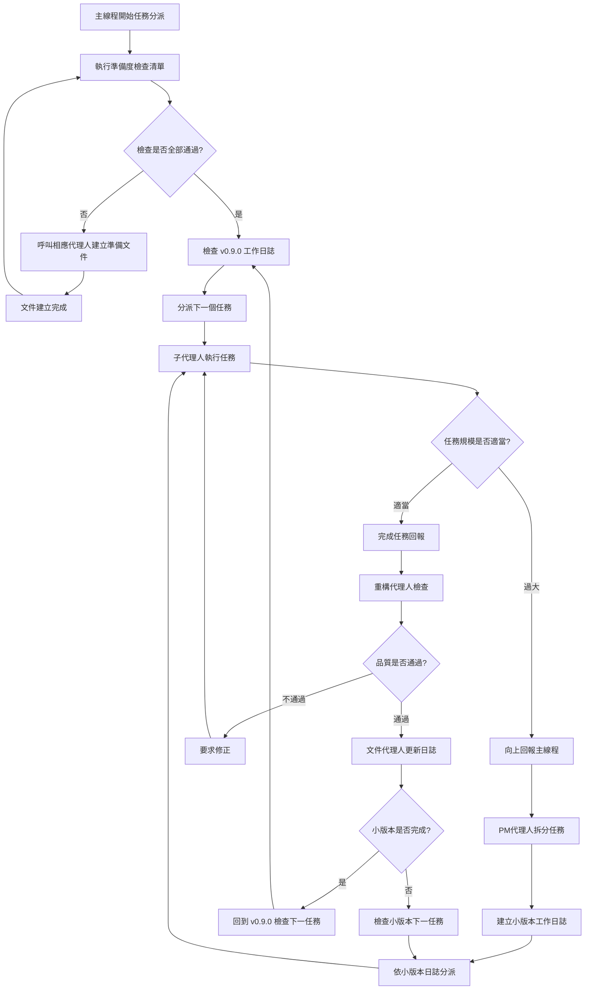
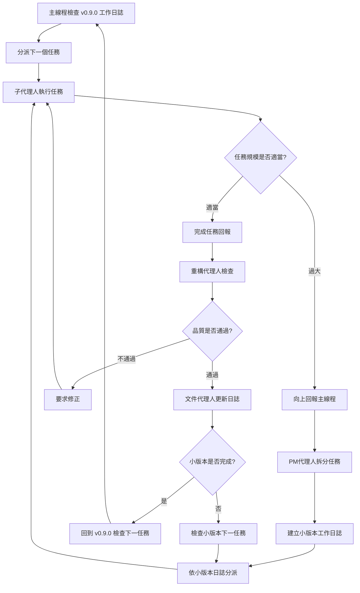

## 📖 方法論概述

本方法論定義了大規模程式碼重構的敏捷開發流程，採用主線程統籌分派、子代理人專責執行的協作模式，確保重構品質和進度控制。

因為AI的上下文有限，為了開發穩定必須讓主線掌握狀況避免因為compact而失去記憶，同時如果讓代理人自行工作，不能確定主線程會怎麼交接任務，所以要確保規格內容正確在流程啟動之前正確被分派

## 核心原則

### 1. 主線程職責專一化

- **只負責任務分派和統籌管理**，絕不親自執行具體重構工作
- 依照工作日誌規劃分派任務給相應的子代理人
- 維持敏捷開發的節奏和品質標準

### 2. 任務原子化拆分

- 每個小版本任務必須在 1-2 小時內完成
- 任務影響檔案數量控制在 5 個以下
- 每個任務都有明確的完成標準和驗收條件

### 3. 品質門檻強制執行

- 每個任務完成後必須通過測試檢查
- 重構代理人強制驗證程式碼品質
- 100% 測試通過率是最低要求

## 🤖 Agent 角色定義

### 主線程 (Main Thread)

**職責**：

- 📋 依照 v0.9.0 工作日誌分派任務
- 🎯 維持敏捷開發節奏
- 📊 監控整體進度和品質
- 🚨 處理升級請求和任務重新分派

**禁止行為**：

- ❌ 親自閱讀或修改程式碼
- ❌ 執行具體的重構工作
- ❌ 繞過子代理人直接操作

### 子代理人 (Sub-Agents)
**職責**：
- 🔧 執行指派的具體重構任務
- 📝 回報任務完成狀態和結果
- 🚨 發現任務規模過大時向上回報
- ✅ 確保任務符合完成標準

**專業分工**：
- **lavender-interface-designer**: TDD Phase 1 功能設計
- **sage-test-architect**: TDD Phase 2 測試設計
- **pepper-test-implementer**: TDD Phase 3 實作規劃
- **cinnamon-refactor-owl**: TDD Phase 4 重構執行
- **mint-format-specialist**: 程式碼格式化和品質修正

### 重構代理人 (Refactor Validator)
**職責**：
- 🔍 檢查子代理人完成的重構工作
- ✅ 驗證程式碼品質和功能正確性
- 📊 確認測試通過率和效能標準
- 🎯 批准任務完成或要求修正

**代理人**: `cinnamon-refactor-owl`

### PM 代理人 (Project Manager)
**職責**：
- 📋 任務規模過大時進行二次拆分
- 📝 更新小版本工作日誌
- 🎯 重新規劃任務執行順序
- 📊 管理任務依賴關係

**代理人**: `rosemary-project-manager`

### 文件代理人 (Documentation Agent)
**職責**：
- 📝 更新小版本工作日誌
- ✅ 標記小版本完成狀態
- 📊 記錄任務執行結果
- 🔄 同步文件狀態

**代理人**: `memory-network-builder`

## 🚨 任務分派前強制檢查清單

**重要**: 在分派任何重構任務前，主線程必須先通過以下檢查清單。如果無法回答這些問題，必須優先建立準備文件。

### 📋 準備度檢查問題

#### 1. 明確的文件規劃

- [ ] **API 規格是否完整？** 代理人知道要實作什麼樣的介面和行為嗎？
- [ ] **設計文件是否具體？** 有詳細的類別定義、方法簽名、使用範例嗎？
- [ ] **架構圖是否清晰？** 代理人知道新系統的整體架構和元件關係嗎？

#### 2. 測試先行策略

- [ ] **測試規格是否存在？** 每個元件都有對應的測試規格和驗收標準嗎？
- [ ] **TDD 流程是否明確？** 代理人知道要先寫什麼測試再實作嗎？
- [ ] **效能標準是否定義？** 有明確的效能基準和測試方法嗎？

#### 3. 實作目標明確性

- [ ] **完成標準是否可測量？** 代理人知道什麼程度才算任務完成嗎？
- [ ] **使用範例是否充足？** 有具體的程式碼範例展示最終產品嗎？
- [ ] **移轉策略是否清楚？** 有舊系統到新系統的具體移轉指引嗎？

#### 4. 風險評估與應對

- [ ] **潛在問題是否識別？** 有預見可能的技術難點和解決方案嗎？
- [ ] **回滾計畫是否準備？** 出問題時有明確的回滾和修復策略嗎？
- [ ] **依賴關係是否梳理？** 知道任務間的依賴順序和影響範圍嗎？

### 🚨 準備度檢查失敗處理

**如果任何檢查項目回答為「否」，必須執行以下優先動作**：

#### 優先動作1: 建立 API 規格文件

```markdown
檔案: docs/v0.9.0-error-handling-api-specification.md
內容:
- 完整的介面定義
- 詳細的方法簽名
- 具體的使用範例
- 效能要求規格
```

#### 優先動作2: 建立 TDD 測試規格

```markdown
檔案: docs/v0.9.0-error-handling-test-specification.md
內容:
- 每個元件的測試案例
- 驗收測試標準
- 效能基準測試
- 整合測試場景
```

#### 優先動作3: 建立移轉指引

```markdown
檔案: docs/v0.9.0-error-handling-migration-guide.md
內容:
- 舊系統→新系統對照表
- 常見使用場景範例
- 最佳實踐指引
- 問題排除手冊
```

#### 優先動作4: 建立實作範例

```markdown
檔案: docs/v0.9.0-error-handling-implementation-examples.md
內容:
- 完整的程式碼範例
- 使用情境示範
- 常見模式展示
- 錯誤處理最佳實踐
```

### 📝 準備文件建立流程

#### 文件建立責任分工

- **API 規格**: lavender-interface-designer (功能設計專家)
- **測試規格**: sage-test-architect (測試設計專家)
- **移轉指引**: memory-network-builder (文件專家)
- **實作範例**: pepper-test-implementer (實作規劃專家)

#### 文件品質標準

- **完整性**: 涵蓋所有必要資訊，無遺漏
- **具體性**: 提供可執行的詳細指引，非概念性描述
- **一致性**: 與整體架構和設計原則保持一致
- **可測試性**: 所有規格都可以通過測試驗證

## 🔄 敏捷重構流程

### 增強版執行循環



### 標準執行循環



### 任務分派規則

#### 1. 任務優先序
1. **架構核心任務** - 影響多個模組的基礎架構變更
2. **高風險任務** - 影響關鍵業務邏輯的重構
3. **中風險任務** - 次要功能模組的重構
4. **低風險任務** - 測試檔案和工具檔案的更新

#### 2. 任務大小控制
**理想任務大小**：
- ⏱️ 執行時間：1-2 小時
- 📁 影響檔案：1-5 個檔案
- 🧪 測試影響：單一測試套件
- 🔧 複雜度：單一職責變更

**任務過大指標**：
- ⚠️ 影響檔案 > 5 個
- ⚠️ 預估時間 > 3 小時
- ⚠️ 涉及多個模組
- ⚠️ 需要連環修改

#### 3. 升級處理機制

**何時觸發升級**：

- 子代理人回報任務規模過大
- 發現任務間複雜依賴關係
- 需要重新評估技術方案
- 遇到無法解決的技術問題

**升級處理流程**：

1. 子代理人向主線程回報問題
2. 主線程呼叫 PM 代理人進行分析
3. PM 代理人拆分任務並建立小版本日誌
4. 依新的小版本日誌重新分派任務

## 📋 任務執行標準

### 任務分派標準格式

每個任務分派必須包含：

```markdown
## 任務 v0.9.X - [任務名稱]

### 🎯 任務目標
- 明確的完成目標描述
- 具體的技術實現要求

### 📋 參考文件 (必要)
- 設計規格：[指定設計文件位置]
- 測試規格：[指定測試文件位置，TDD 必須參考]
- 依賴文件：[指定相關模組或類別文件]
- 架構文件：[指定整體架構說明文件]

### 📁 影響範圍
- 需要修改的檔案清單
- 預估影響的測試檔案
- 影響的依賴關係

### 🔗 依賴關係
- 前置任務：[必須完成的前置任務清單]
- 後續任務：[依賴此任務的後續任務]
- 並行任務：[可同時進行的相關任務]

### ✅ 完成標準
- [ ] 功能實現完成
- [ ] 測試通過率 100%
- [ ] 程式碼品質檢查通過
- [ ] 無新增警告或錯誤
- [ ] 參考文件更新 (如有需要)

### 🚨 風險評估
- 技術風險等級：高/中/低
- 潛在影響評估
- 回滾策略

### 👤 指派代理人
- 主要執行代理人：[Agent Name]
- 檢查代理人：cinnamon-refactor-owl

### 📝 後續更新責任 (準備階段特有)
- [ ] 更新相關任務的參考文件欄位
- [ ] 補充依賴任務的詳細資訊
- [ ] 建立文件間的關聯性
```

### 任務完成回報格式

```markdown
## 任務完成回報 - v0.9.X

### ✅ 完成項目
- [x] 目標1 完成
- [x] 目標2 完成
- [x] 測試驗證通過

### 📊 品質指標
- 測試通過率：100%
- 程式碼覆蓋率：維持或提升
- 效能影響：無負面影響

### 🔧 技術變更摘要
- 修改檔案數量：N 個
- 新增程式碼行數：+N 行
- 移除程式碼行數：-N 行

### 🚨 發現問題
- 無問題 / 發現問題清單

### 📝 後續建議
- 下一個任務的建議
- 潛在改善機會
```

## 🚨 品質控制機制

### 強制檢查點

#### 任務執行前檢查

- [ ] 任務目標明確定義
- [ ] 完成標準可測量
- [ ] 指派代理人明確
- [ ] 風險評估完成

#### 任務執行中檢查

- [ ] 定期進度回報
- [ ] 問題及時升級
- [ ] 品質標準持續監控
- [ ] 測試覆蓋率維持

#### 任務完成後檢查

- [ ] 重構代理人驗證通過
- [ ] 測試通過率 100%
- [ ] 程式碼品質符合標準
- [ ] 文件同步更新

### 失敗處理機制

#### 任務失敗類型

1. **技術失敗** - 無法達成技術目標
2. **品質失敗** - 無法通過品質檢查
3. **時程失敗** - 超出預估完成時間
4. **範圍失敗** - 任務範圍超出預期

#### 失敗處理策略

1. **技術失敗** → PM 代理人重新設計技術方案
2. **品質失敗** → 重構代理人指導修正
3. **時程失敗** → PM 代理人拆分任務
4. **範圍失敗** → 主線程重新分派任務

## 📊 進度追蹤機制

### 三層進度管理

#### 1. 大版本層級 (v0.9.x)

- **追蹤文件**: `docs/work-logs/v0.9.0-error-handling-system-refactor.md`
- **更新頻率**: 階段完成時
- **責任代理**: 主線程

#### 2. 小版本層級 (v0.9.1, v0.9.2, ...)

- **追蹤文件**: `docs/work-logs/v0.9.X-[specific-task].md`
- **更新頻率**: 任務完成時
- **責任代理**: 文件代理人

#### 3. 任務層級 (TodoList)

- **追蹤工具**: TodoWrite 工具
- **更新頻率**: 即時更新
- **責任代理**: 執行代理人

### 關鍵指標監控

#### 效率指標

- 任務完成速度 (任務數/天)
- 平均任務執行時間
- 升級請求頻率
- 重做次數

#### 品質指標

- 測試通過率趨勢
- 程式碼覆蓋率變化
- 新增錯誤/警告數量
- 效能回歸情況

#### 協作指標

- 代理人回應時間
- 任務交接效率
- 溝通品質評分
- 問題解決時間

## 🎯 成功標準

### 方法論成功指標

#### 效率成功標準

- [ ] 30-40 個小版本任務如期完成
- [ ] 每個任務平均完成時間 < 2 小時
- [ ] 升級請求 < 10% 總任務數
- [ ] 重做次數 < 5% 總任務數

#### 品質成功標準

- [ ] 100% 測試通過率維持
- [ ] 程式碼覆蓋率不下降
- [ ] 0 個新增的錯誤或警告
- [ ] 效能目標全部達成

#### 協作成功標準

- [ ] 代理人角色職責清晰
- [ ] 任務交接無遺漏
- [ ] 問題升級機制有效
- [ ] 文件同步及時準確

### 重構成功標準

#### 架構成功標準

- [ ] 完全符合設計文件 v2.0 規範
- [ ] 原生 Exception 系統實作完成
- [ ] 舊錯誤處理系統完全移除
- [ ] 統一錯誤處理入口建立

#### 效能成功標準

- [ ] 錯誤建立時間 < 0.1ms
- [ ] 記憶體占用 < 200 bytes
- [ ] 程式碼量減少 ~80%
- [ ] 編譯時間改善

## 📝 使用指引

### 主線程使用方式

1. **檢查 v0.9.0 工作日誌**，找到下一個待執行任務
2. **分派任務**給適當的子代理人，使用標準任務格式
3. **等待回報**，不親自執行任何程式碼修改
4. **處理升級**，必要時呼叫 PM 代理人
5. **確認完成**，由重構代理人和文件代理人完成驗證

### 子代理人使用方式

1. **接收任務**，確認任務目標和完成標準
2. **評估規模**，如發現過大立即向上回報
3. **執行任務**，專注於指派的具體工作
4. **回報結果**，使用標準回報格式
5. **配合檢查**，與重構代理人協作完成驗證

### 緊急情況處理

#### 代理人無法執行任務

1. 立即向主線程回報
2. 主線程評估替代方案
3. 必要時調整任務或更換代理人

#### 技術方案遇到阻礙

1. 子代理人立即停止執行
2. 向主線程詳細回報問題
3. 主線程呼叫 PM 代理人重新設計

#### 品質標準無法達成

1. 重構代理人拒絕通過
2. 明確指出品質問題
3. 要求修正或重新設計

---
