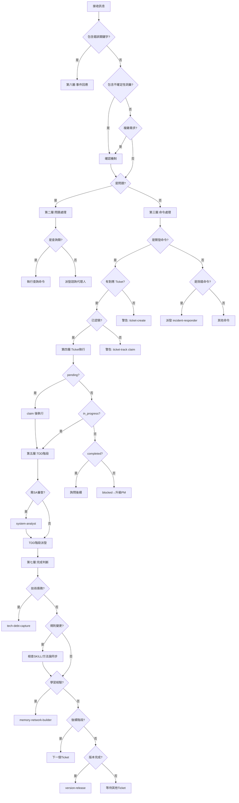
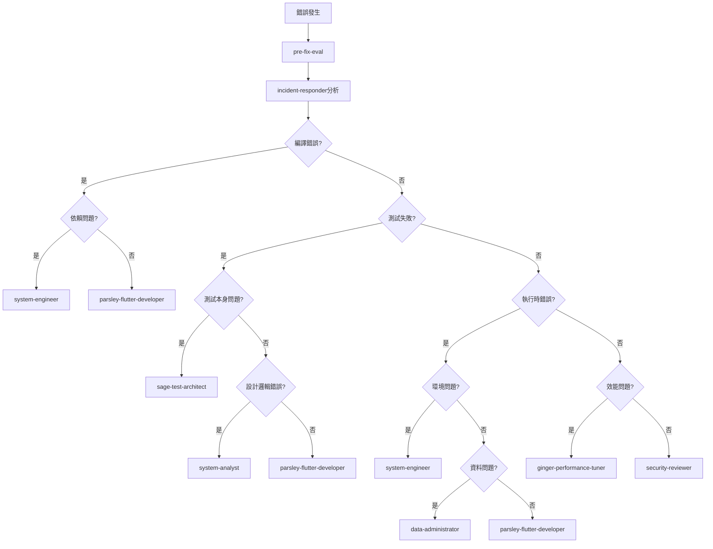
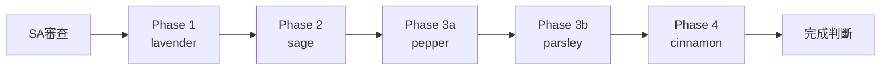

# 主線程決策樹

我之前做了很多規範去強迫或者限制AI執行的時候需要記住所有的判斷原則，但是實際執行狀況並不理想，生成式AI的問題就是每次生成的內容都是不穩定的，那後來我改變了想法，先使用 hook 禁止 主線程(我跟AI的對話視窗)編輯工作日誌以外的資料夾 ，然後要求主線程必須依照我設計的決策樹去分派任務，但是就算把規則這樣寫了，也不能保證AI真的都會依照決策樹執行，所以進一步再加入一個 hook ，我要求分派任務的時候一定要有 ticket ，否則代理人會拒絕執行，而 建立 ticket 的方式，是必須依照 ticket 範本去建立 ticket ，範本中有一個欄位強制需要填入決策樹的思考過程，所以能夠保證在生成 ticket 的時候，會做一輪決策樹的思考。

### 所以這個文件就是完整的決策樹設計內容，文件末端有附上 完整流程圖
---

## 決策流程總覽（二元樹結構）

```text
接收訊息
    |
    v
[第零層] 明確性檢查
    |
    +-- 包含明確錯誤關鍵字? ─是→ [第六層] 事件回應流程
    |
    +─── 否 → 包含不確定性詞彙? ─是→ [確認機制]
    |                            |
    |                            └─否→ 複雜需求? ─是→ [確認機制]
    |                                      |
    |                                      └─否→ [第一層]
```

**第零層後的流程**：
- 錯誤優先：直接進入第六層（事件回應流程）
- 不確定性詞彙：確認後進入第一層
- 複雜需求：確認後進入第一層
- 明確內容：進入第一層

---

## 第零層：明確性檢查

> **核心原則**：當定義不明確時，應該往上詢問確認，而非強行做出判斷。

### 觸發確認機制的情境

| 情境 | 觸發條件 | 確認目標 |
|------|---------|---------|
| 不確定性詞彙 | 包含「好像」、「可能」、「似乎」等 | 確認問題性質 |
| 複雜需求 | 觸發 3+ 代理人 | 確認 use case 和優先級 |
| 模糊需求 | 無法用「動詞+目標」描述 | 確認具體需求 |
| 多解釋可能 | 可解釋為多種意圖 | 確認用戶意圖 |

### 不確定性詞彙清單

| 類型 | 詞彙 |
|------|------|
| 推測 | 好像、似乎、可能、應該是、大概 |
| 疑問 | 是不是、會不會、有沒有 |
| 模糊 | 有點、有時候、偶爾 |

### 確認流程

```text
接收訊息
    |
    v
[第零層] 明確性檢查
    |
    +-- 包含明確錯誤關鍵字（test failed, crash, error）?
    |   +-- 是 --> 直接進入錯誤流程（不需確認）
    |
    +-- 包含不確定性詞彙?
    |   +-- 是 --> [確認機制] 向用戶確認問題性質
    |
    +-- 複雜需求（觸發 3+ 代理人）?
    |   +-- 是 --> [確認機制] 向用戶確認 use case
    |
    +-- 明確 --> 繼續第一層判斷
```

### 確認問題模板

**不確定性詞彙確認**：
```text
您提到「{問題描述}」，請確認：
1. 這是一個需要修復的錯誤嗎？
2. 還是您想諮詢/了解如何處理？
```

**複雜需求確認**：
```text
這個需求涉及多個面向（{面向列表}），請確認：
1. 主要目標是什麼？
2. 有沒有優先級順序？
3. 是否有相關的 use case 或規格文件？
```

---

## 第一層：訊息類型判斷

```text
[第零層完成]
    |
    v
是問題? ─是→ [第二層] 問題處理流程
       |
       └─否→ [第三層] 命令處理流程
```

### 訊息類型判斷規則

| 訊息類型 | 識別關鍵字 |
|---------|-----------|
| 問題 | "怎麼樣"、"進度"、"為什麼"、"如何"、"是什麼"、"?" |
| 命令 | "實作"、"建立"、"修復"、"處理"、"執行"、"開始" |

---

## 第二層：問題處理流程

```text
是問題
    |
    v
是查詢類問題? ─是→ 執行查詢命令
             |
             └─否→ 派發對應諮詢代理人
```

### 查詢類問題判斷

| 問題類型 | 識別關鍵字 | 執行動作 |
|---------|-----------|---------|
| Ticket 進度總覽 | "進度"、"狀態"、"完成了嗎" | `/ticket-track summary` |
| 特定 Ticket 查詢 | "Ticket {id}"、"查詢 {id}" | `/ticket-track query {id}` |
| 版本進度查詢 | "版本進度"、"v0.x.x 進度" | 讀取 `docs/work-logs/{version}/` |
| 待辦事項查詢 | "待辦"、"還有什麼要做" | 讀取 `docs/todolist.md` |

### 諮詢類問題派發

| 問題類型 | 識別關鍵字 | 派發代理人 |
|---------|-----------|-----------|
| 系統架構問題 | "架構"、"設計模式"、"系統結構" | → [system-analyst](../agents/system-analyst.md) |
| UI/UX 設計問題 | "畫面"、"介面"、"UI"、"操作流程" | → [system-designer](../agents/system-designer.md) |
| 資料設計問題 | "資料庫"、"資料結構"、"儲存" | → [data-administrator](../agents/data-administrator.md) |
| 環境配置問題 | "環境"、"配置"、"安裝"、"設定" | → [system-engineer](../agents/system-engineer.md) |
| 安全問題 | "安全"、"漏洞"、"認證"、"授權" | → [security-reviewer](../agents/security-reviewer.md) |
| 效能問題 | "效能"、"FPS"、"卡頓"、"延遲"、"慢" | → ginger-performance-tuner |

---

## 第三層：命令處理流程

```text
是命令
    |
    v
是開發/修改命令? ─是→ [Level 2] Hook 系統驗證 Ticket
               |
               └─否→ 是除錯命令? ─是→ [強制] 派發 incident-responder
                                |
                                └─否→ 其他命令類型 (ignore)
```

### Level 2 驗證：Ticket 存在檢查

**何時驗證**：接收開發/修改命令後立即執行
**誰負責**：Hook 系統（command-entrance-gate-hook.py）

```sql
是開發/修改命令
    |
    v
有對應 Ticket? ─是→ Ticket 已認領? ─是→ 涉及安全相關? ...
             |                    |
             |                    └─否→ [Ticket 執行流程]
             |
             └─否→ [警告] 建議執行 /ticket-create
                 (用戶決策：繼續或修正)
```

| 檢查點 | 驗證內容 | 成功時 | 失敗時 |
|--------|---------|--------|--------|
| Ticket 存在檢查 | 是否存在 pending/in_progress Ticket | 進入認領檢查 | 輸出 `/ticket-create` 建議 |
| Ticket 認領檢查 | Ticket 是否已認領（status=in_progress） | 進入命令執行 | 輸出 `/ticket-track claim` 建議 |

### 開發/修改命令

```sql
開發/修改命令（已通過 Level 2 驗證）
    |
    +-- 涉及安全相關?（認證/授權/API/敏感資料）
    |   +-- 是 --> [強制] 派發 security-reviewer
    |
    +-- 有對應 Ticket?
    |   +-- 是 --> /ticket-track query {id}
    |   |         --> 進入 [Ticket 執行流程]
    |   |
    |   +-- 否 --> 是新功能需求?
    |              +-- 是 --> /ticket-create → SA 前置審查
    |              +-- 否（小型修改）--> /ticket-create → TDD 流程
```

**說明**：
- Level 2 驗證是非阻塞式的警告機制（不會強制停止執行）
- 用戶可選擇忽略警告繼續執行，但應遵循建議操作
- 驗證檢查點詳見：command-entrance-gate-hook.py

### 安全相關命令（強制規則）

| 安全類型 | 識別關鍵字 |
|---------|-----------|
| 認證相關 | "authentication", "login", "password", "token", "session" |
| 授權相關 | "authorization", "permission", "role", "access control" |
| 輸入處理 | "user input", "form validation", "request body" |
| 敏感資料 | "credential", "secret", "API key", "private key" |

### 除錯命令（強制規則）

| 錯誤類型 | 識別關鍵字 |
|---------|-----------|
| 測試失敗 | "test failed", "測試失敗", "X tests failed", "FAILED" |
| 編譯錯誤 | "compile error", "編譯錯誤", "build failed" |
| 執行時錯誤 | "runtime error", "exception", "crash" |
| 用戶回報問題 | "bug", "問題", "不正常", "出錯" |

**強制動作**：除錯命令 → [強制] 派發 incident-responder

### 禁止行為（與 Level 2 驗證關係）

**禁止違反 Level 2 驗證結果**：

| 禁止行為 | 正確做法 | 違規等級 |
|---------|---------|---------|
| 主線程直接修改程式碼（未建立 Ticket） | 按 Hook 建議執行 `/ticket-create` | 嚴重 |
| 主線程跳過 incident-responder | 必須派發 incident-responder | 嚴重 |
| 忽視 Level 2 警告後直接修改 | 應修正 Ticket 狀態後再繼續 | 中等 |
| 在未認領 Ticket 的情況下修改 | 執行 `/ticket-track claim {id}` 先認領 | 中等 |

**警告類型（由 Hook 輸出）**：
- 「未找到待處理 Ticket」：建議執行 `/ticket-create`
- 「Ticket 尚未認領」：建議執行 `/ticket-track claim {id}`

---

## 第四層：Ticket 執行流程

```text
[Ticket 驗證通過]
    |
    v
Ticket 是 pending? ─是→ 執行 /ticket-track claim {id}
               |      └→ [階段判斷]
               |
               └─否→ Ticket 是 in_progress? ─是→ 繼續執行 [階段判斷]
                                          |
                                          └─否→ Ticket 是 completed? ─是→ 詢問後續任務
                                                                    |
                                                                    └─否→ (blocked) 升級 PM
```

### Ticket 狀態對應動作

| Ticket 狀態 | 動作 | 下一步 |
|------------|------|--------|
| pending | 執行 `/ticket-track claim {id}` | 進入階段判斷 |
| in_progress | 繼續執行 | 進入階段判斷 |
| completed | 詢問是否有後續任務 | 根據回答決定 |
| blocked | 升級到 PM | PM 處理阻塞 |

---

## 第四層半：並行派發判斷

> 詳細規則：[parallel-dispatch](../guides/parallel-dispatch.md)

### 並行派發觸發條件

| 條件 | 說明 | 判斷方法 |
|------|------|---------|
| 多任務 | 有 2+ 個待處理任務 | 同一 Wave 中有多個 pending Ticket |
| 無相互依賴 | 任務之間無先後順序 | Ticket 間無 blockedBy 關係 |
| 無檔案重疊 | 修改的檔案集合無交集 | 檢查 Ticket 的 target 目錄 |
| 同類型任務 | 屬於同一 TDD 階段 | 都是 Phase 3b 或都是 Phase 1 |

### 並行安全檢查清單

```markdown
- [ ] 檔案無重疊：各任務修改的檔案集合無交集
- [ ] 測試無衝突：各任務的測試可獨立執行
- [ ] 依賴無循環：任務之間無先後依賴關係
- [ ] 資源無競爭：不會同時存取相同外部資源
```

---

## 第五層：TDD 階段判斷

```text
[Ticket 認領並執行]
    |
    v
需要 SA 前置審查? ─是→ [派發] system-analyst
               |     └→ (SA 審查通過) [進入 Phase 1]
               |
               └─否→ [TDD 階段派發]
```

### TDD 四階段派發

| 階段 | 代理人 | 進入條件 | 完成後 |
|------|-------|---------|--------|
| SA 前置審查 | [system-analyst](../agents/system-analyst.md) | 新功能/架構變更 | Phase 1 |
| Phase 1 | [lavender-interface-designer](../agents/lavender-interface-designer.md) | SA 通過 | Phase 2 |
| Phase 2 | [sage-test-architect](../agents/sage-test-architect.md) | Phase 1 完成 | Phase 3a |
| Phase 3a | [pepper-test-implementer](../agents/pepper-test-implementer.md) | Phase 2 完成 | Phase 3b |
| Phase 3b | [parsley-flutter-developer](../agents/parsley-flutter-developer.md) | Phase 3a 完成 | Phase 4 |
| Phase 4 | [cinnamon-refactor-owl](../agents/cinnamon-refactor-owl.md) | Phase 3b 完成 | [完成判斷] |

---

## 第六層：事件回應流程（錯誤分類決策樹）

> 詳細流程：[incident-response](../flows/incident-response.md)

### 二元化錯誤分類樹

```text
[錯誤發生] --> /pre-fix-eval --> 派發 incident-responder
                |
                v
           是編譯錯誤? ─是→ 依賴問題? ─是→ [Ticket] --> system-engineer
                     |              |
                     |              └─否→ [Ticket] --> parsley-flutter-developer
                     |
                     └─否→ 是測試失敗? ─是→ 測試本身問題? ─是→ [Ticket] --> sage-test-architect
                                   |                    |
                                   |                    └─否→ 設計邏輯錯誤? ─是→ [Ticket] --> system-analyst
                                   |                                       |
                                   |                                       └─否→ [Ticket] --> parsley-flutter-developer
                                   |
                                   └─否→ 是執行時錯誤? ─是→ 環境問題? ─是→ [Ticket] --> system-engineer
                                                      |              |
                                                      |              └─否→ 資料問題? ─是→ [Ticket] --> data-administrator
                                                      |                               |
                                                      |                               └─否→ [Ticket] --> parsley-flutter-developer
                                                      |
                                                      └─否→ 是效能問題? ─是→ [Ticket] --> ginger-performance-tuner
                                                                       |
                                                                       └─否→ [Ticket] --> security-reviewer
```

### 錯誤類型派發表

| 錯誤分類 | 子分類 | 派發代理人 |
|---------|-------|-----------|
| 編譯錯誤 | 依賴問題 | system-engineer |
| 編譯錯誤 | 類型/語法錯誤 | parsley-flutter-developer |
| 測試失敗 | 測試本身問題 | sage-test-architect |
| 測試失敗 | 設計邏輯錯誤 | system-analyst |
| 測試失敗 | 實作不符預期 | parsley-flutter-developer |
| 執行時錯誤 | 環境問題 | system-engineer |
| 執行時錯誤 | 資料問題 | data-administrator |
| 執行時錯誤 | 程式錯誤 | parsley-flutter-developer |
| 效能問題 | - | ginger-performance-tuner |
| 安全問題 | - | security-reviewer |

---

## 第七層：完成判斷流程

```text
[階段/Ticket 完成]
    |
    v
有技術債務記錄? ─是→ 執行 /tech-debt-capture
             |     └→ 建立技術債務 Ticket
             |
             └─否→ 涉及規則變更? ─是→ 檢查 SKILL/方法論同步
                              |     └→ 更新相關引用和內容
                              |
                              └─否→ 需記錄學習經驗? ─是→ [派發] memory-network-builder
                                                  |
                                                  └─否→ 有後續階段? ─是→ 更新 worklog 進入下一個 Ticket
                                                               |
                                                               └─否→ 版本所有 Ticket 完成? ─是→ /version-release check
                                                                                       |
                                                                                       └─否→ 等待其他 Ticket 完成
```

### 完成判斷規則

| 判斷項目 | 條件 | 動作 |
|---------|------|------|
| 技術債務 | 發現可優化項目 | `/tech-debt-capture` 建立 Ticket |
| 規則變更同步 | 修改了 `.claude/rules/` 下的檔案 | 檢查 SKILL 和方法論是否需要同步 |
| 學習經驗 | 重要決策或經驗 | 派發 memory-network-builder 記錄 |
| 後續階段 | 有對應下一階段 | 更新 worklog 進入下一個 Ticket |
| 版本完成 | 所有 Ticket 完成 | `/version-release check` 準備發布 |
| 等待中 | 其他 Ticket 未完成 | 繼續等待其他 Ticket

### 規則變更同步檢查

當修改了 `.claude/rules/` 下的規則檔案時，必須檢查以下相關文件是否需要同步更新：

| 檢查項目 | 檔案位置 | 說明 |
|---------|---------|------|
| 相關 SKILL | `.claude/skills/` | 檢查是否有 SKILL 引用了變更的規則 |
| 方法論 | `.claude/methodologies/` | 檢查是否有方法論引用了變更的規則 |
| 代理人定義 | `.claude/agents/` | 檢查代理人定義是否需要更新 |
| 範本 | `.claude/templates/` | 檢查範本是否需要同步 |

**同步檢查命令**：

```bash
# 搜尋引用了特定規則檔案的文件
grep -r "rules/{changed-file}" .claude/
```

---

## 代理人觸發優先級

> 詳細定義：[agents/overview](../agents/overview.md)

### 優先級順序

**注意**：以下優先級適用於代理人派發決策。此外還有 **Level 2 驗證** 在命令入口執行。

```text
Level 2: Hook 系統驗證 - 命令入口檢查點
    |
    +-- Ticket 存在？
    +-- Ticket 已認領？

Level 1: incident-responder（錯誤/失敗最高優先）
Level 2 (代理人): system-analyst（架構審查）
Level 3: security-reviewer（安全審查）
Level 4: 其他專業代理人（DBA, SE, SD, ginger 等）
Level 5: TDD 階段代理人（lavender, sage, pepper, parsley, cinnamon）
```

**Level 2 驗證特性**：
- 觸發時機：接收開發命令後立即執行（比任何代理人派發都早）
- 驗證責任：Hook 系統完全自動化
- 特性：非阻塞式警告（不會強制停止）

### 多條件觸發處理規則

| 觸發組合 | 處理方式 | 理由 |
|---------|---------|------|
| 錯誤 + 任何 | incident-responder 先處理 | 錯誤必須優先排除 |
| SA + security | SA 先審查架構 | 安全審查依賴架構設計 |
| SA + 專業代理人 | SA 先分解需求 | 需先確定範圍 |
| 多個專業代理人 | SA 協調或按需求分解為多 Ticket | 避免職責混亂 |

---

## 任務拆分認知負擔檢查

> 詳細指南：[task-splitting](../guides/task-splitting.md)

### 拆分觸發條件

**任一條件符合即需拆分**：

| 條件 | 閾值 | 說明 |
|------|------|------|
| 變數狀態數 | > 5 個 | 單一任務需追蹤超過 5 個變數狀態 |
| 架構層級數 | > 2 層 | 任務跨越 3+ 架構層 |
| 依賴關係數 | > 3 個 | 任務依賴超過 3 個其他模組 |
| 修改檔案數 | > 5 個 | 單一任務需修改超過 5 個檔案 |

### 複雜度快速評估

| 總分 | 複雜度 | 建議 |
|------|--------|------|
| 0-2 | 低 | 直接派發單一代理人 |
| 3-5 | 中 | 謹慎評估，考慮拆分 |
| 6-8 | 高 | 必須拆分後再派發 |

---

## 派發記錄要求

### Ticket 決策樹欄位（必填）

所有 Ticket 必須包含 `decision_tree_path` 欄位，記錄從進入決策樹到最終決策的完整路徑。

**欄位格式**：

```yaml
decision_tree_path:
  entry_point: "{進入層級}"           # 第零層~第七層
  decision_nodes:                      # 經過的決策節點
    - layer: "{層級}"
      question: "{決策問題}"
      answer: "{答案}"
      next_action: "{下一步}"
  final_decision: "{最終決策}"         # 派發的代理人或執行的動作
  rationale: "{決策理由}"              # 簡述決策原因
```

### 驗證機制

- **建立時**：Ticket 建立工具自動要求填寫
- **派發時**：Hook 系統驗證決策樹欄位存在
- **無效 Ticket**：缺少決策樹欄位的 Ticket 無法用於派發

### 為何需要決策樹欄位？

| 價值 | 說明 |
|------|------|
| 釐清任務內容 | 強制記錄決策過程，確保任務定義明確 |
| 知識傳承 | 決策路徑可作為後續類似任務的參考 |
| 品質把關 | 防止跳過必要的分析步驟 |
| 模型優化 | 模糊之處可提出討論，持續改進決策樹 |

---

## 命令快速參考

### Ticket 管理命令

| 命令 | 用途 | 觸發時機 |
|------|------|---------|
| `/ticket-create` | 建立新 Ticket | 新任務、無對應 Ticket |
| `/ticket-track summary` | 查詢所有 Ticket 進度 | 用戶詢問進度 |
| `/ticket-track query {id}` | 查詢特定 Ticket | 需要詳細資訊 |
| `/ticket-track claim {id}` | 認領 Ticket | 開始執行時 |
| `/ticket-track complete {id}` | 完成 Ticket | 階段完成時 |
| `/ticket-track release {id}` | 釋放 Ticket | 無法繼續時 |

### 決策和評估命令

| 命令 | 用途 | 觸發時機 |
|------|------|---------|
| `/5w1h-decision` | 5W1H 決策框架 | 需要決策時 |
| `/pre-fix-eval` | 修復前評估 | 除錯命令入口（強制） |
| `/tech-debt-capture` | 技術債務捕獲 | Phase 4 完成後（強制） |

### 版本管理命令

| 命令 | 用途 | 觸發時機 |
|------|------|---------|
| `/version-release check` | 檢查發布準備度 | 版本完成時（強制） |
| `/version-release update-docs` | 更新文件 | 發布前 |
| `/version-release release` | 執行發布 | 確認發布 |

### 其他常用命令

| 命令 | 用途 |
|------|------|
| `/commit-as-prompt` | 提交流程 |
| `/lsp-first` | LSP 使用指南 |
| `/startup-check` | Session 開始檢查 |
| `/cognitive-load` | 認知負擔評估 |
| `/decision-helper` | 決策樹助手 |

---

## 強制執行命令

以下命令在特定情境下**必須執行**，不可跳過：

| 情境 | 強制命令 | 理由 |
|------|---------|------|
| 錯誤/失敗發生 | `/pre-fix-eval` | 防止衝動修復 |
| Phase 4 完成 | `/tech-debt-capture` | 捕獲技術債務 |
| 版本發布前 | `/version-release check` | 確保發布品質 |

---

## 違規處理

### 主線程違規行為

| 違規行為 | 處理方式 |
|---------|---------|
| 跳過 incident-responder 直接修復 | 停止，回滾修改，重新走流程 |
| 未建立 Ticket 就開始實作 | 停止，先建立 Ticket |
| 跳過 SA 前置審查（新功能） | 停止，派發 SA |
| 跳過 Phase 4 | 強制執行 Phase 4 |

---

## 相關文件

### 代理人定義
- [agents/overview](../agents/overview.md) - 代理人總覽

### 執行流程
- [flows/tdd-flow](../flows/tdd-flow.md) - TDD 流程
- [flows/incident-response](../flows/incident-response.md) - 事件回應流程
- [flows/ticket-lifecycle](../flows/ticket-lifecycle.md) - Ticket 生命週期

### 操作指南
- [guides/task-splitting](../guides/task-splitting.md) - 任務拆分指南
- [guides/parallel-dispatch](../guides/parallel-dispatch.md) - 並行派發指南

### Hook 系統
- Hook 實作：`.claude/hooks/command-entrance-gate-hook.py` - Level 2 驗證檢查點實作
- Hook 日誌：`.claude/hook-logs/command-entrance-gate/` - 驗證檢查日誌

### 禁止行為
- [forbidden/skip-gate](../forbidden/skip-gate.md) - Skip-gate 防護

---

**Last Updated**: 2026-01-28
**Version**: 3.1.0

**Change Log**:
- v3.1.0 (2026-01-28): 新增規則變更同步檢查
  - 第七層新增「規則變更同步」判斷節點
  - 當修改 `.claude/rules/` 時，強制檢查 SKILL 和方法論是否需要同步
  - 更新 Mermaid 圖表反映新判斷節點
- v3.0.0 (2026-01-28): 完整二元化決策樹結構
  - 將所有決策節點改為嚴格的二元樹結構（只有是/否兩個分支）
  - 重構第零層：3 個連續是/否判斷（錯誤關鍵字→不確定性詞彙→複雜需求）
  - 重構第一層：單一判斷（是問題 vs 是命令）
  - 重構第二層：單一判斷（查詢類 vs 諮詢類）
  - 重構第三層：連續 2 個判斷（開發命令→除錯命令）
  - 重構第四層：連續 3 個判斷（pending→in_progress→completed）
  - 新增第五層：TDD 階段判斷（SA 前置審查 vs 直接進入 TDD）
  - 重構第六層：完整二元化錯誤分類樹（編譯→測試→執行時→效能→安全）
  - 重構第七層：連續 4 個判斷（技術債務→學習經驗→後續階段→版本完成）
  - 移除所有多分支節點，實現純二元樹結構
- v2.2.0 (2026-01-27): 新增派發記錄要求章節，引入決策樹欄位強制紀錄
- v2.1.0 (2026-01-23): 新增 Level 2 驗證檢查點明確化，填補缺口 3
- v2.0.0 (2026-01-23): 重構為核心決策樹，合併 command-mapping

---

## 附錄：二元決策樹圖表

### 主流程圖（第零層至第七層）



### 第六層：錯誤分類決策樹



### TDD 階段流程


