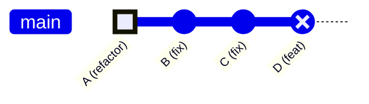
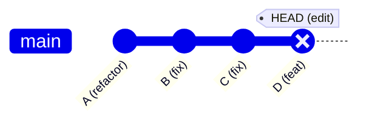
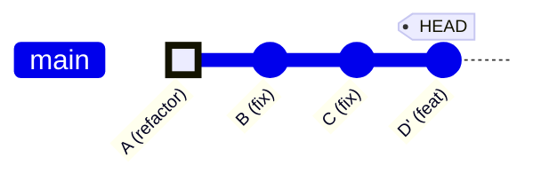

## 問題情境

使用 `git commit --fixup` + `git rebase --autosquash` 修改歷史 commit 後，
修改內容被後續的 commit 覆蓋，導致變更未生效。

### 範例



> 🟢 HIGHLIGHT = 要修改的目標 commit（A）
> 🔴 REVERSE = 意外包含同一檔案變更的 commit（D）

- **目標**：透過 fixup 修改 commit A，移除 `table_service.dart` 中的 try-catch
- **問題**：commit D 在開發時意外 stage 了 `table_service.dart` 的變更，導致 rebase 後 commit D 重新套用了舊的內容，覆蓋了 commit A 的修改

---

## 解決方案：從 commit 中移除不該包含的檔案

### 前置確認

先確認哪些 commit 修改了目標檔案：

```bash
git log --oneline -- lib/data/services/table/table_service.dart
```

輸出類似：

```text
de60cc9 feat: 追加多語系           ← 不該包含此檔案
b55e504 refactor: 各 Service 實作   ← 預期的修改
```

確認 commit D 確實不該包含該檔案後，進行修復。

### 步驟

#### 1. 暫存目前的工作變更（如果有的話）

```bash
git stash
```

#### 2. 啟動 interactive rebase，將目標 commit 標記為 edit

```bash
GIT_SEQUENCE_EDITOR="sed -i '' '1s/^pick/edit/'" git rebase -i <目標commit>~1
```

> **說明**：
> - `<目標commit>~1` 表示從目標 commit 的**前一個** commit 開始 rebase
> - `GIT_SEQUENCE_EDITOR="sed -i '' '1s/^pick/edit/'"` 自動將第一行（目標 commit）從 `pick` 改為 `edit`，避免手動編輯
> - macOS 的 `sed -i` 需要 `''` 參數，Linux 則不需要

以本例來說：

```bash
GIT_SEQUENCE_EDITOR="sed -i '' '1s/^pick/edit/'" git rebase -i de60cc9~1
```

執行後 Git 會停在 `de60cc9`，等待你修改。

此時的 commit 狀態：



#### 3. 將目標檔案還原到「前一個 commit」的狀態

```bash
git checkout HEAD~1 -- <檔案路徑>
```

以本例來說：

```bash
git checkout HEAD~1 -- lib/data/services/table/table_service.dart
```

> **說明**：
> - `HEAD~1` 是目標 commit 的前一個 commit
> - 這會把檔案還原到 commit D **之前**的狀態，等於「撤銷 commit D 對這個檔案的修改」
> - 還原後檔案會自動被加入暫存區（staged）

此時可以用 `git status` 確認狀態，應該會看到：

```text
interactive rebase in progress; onto <hash>
  ...
Changes to be committed:
  (use "git restore --staged <file>..." to unstage)
        modified:   lib/data/services/table/table_service.dart
```

#### 4. 修改 commit 並繼續 rebase

```bash
git commit --amend --no-edit && git rebase --continue
```

> **說明**：
> - `--amend` 修改當前 commit（即 de60cc9）
> - `--no-edit` 保留原本的 commit message 不變
> - `git rebase --continue` 繼續處理後續的 commit

完成後的 commit 狀態：



> D 變為 D'（新的 hash），不再包含 `table_service.dart` 的變更。

#### 5. 恢復暫存的工作變更（如果有的話）

```bash
git stash pop
```

### 驗證

確認目標 commit 不再包含該檔案的修改：

```bash
git show <新的commit hash> --stat
```

輸出的修改清單中不應出現 `table_service.dart`。

---

## 完整指令摘要

```bash
# 0. 暫存工作區
git stash

# 1. 進入 interactive rebase，自動標記目標 commit 為 edit
GIT_SEQUENCE_EDITOR="sed -i '' '1s/^pick/edit/'" git rebase -i <目標commit>~1

# 2. 還原該檔案到 commit 之前的狀態
git checkout HEAD~1 -- <檔案路徑>

# 3. 修改 commit 並繼續 rebase
git commit --amend --no-edit && git rebase --continue

# 4. 恢復工作區
git stash pop

# 5. 驗證
git show HEAD --stat
```

---

## 衍伸：搭配 fixup 的完整工作流程

當你需要**修改歷史 commit A 的內容**，但**後面的 commit D 又意外包含同一個檔案的修改**時：

### 正確操作順序


> 如果先做 fixup 再處理 commit D，fixup 的修改會被 commit D 覆蓋。
> 所以**一定要先清理後面的 commit，再修改前面的 commit**。

### fixup + autosquash 參考指令

```bash
# 建立 fixup commit（指向要修改的目標 commit）
git add <修改的檔案>
git commit --fixup=<目標commit hash>

# 執行 autosquash rebase（自動合併 fixup commit）
GIT_SEQUENCE_EDITOR=true git rebase -i --autosquash <目標commit>~1
```

> **說明**：
> - `--fixup=<hash>` 會建立一個以 `fixup!` 為前綴的 commit
> - `--autosquash` 會自動將 fixup commit 排到目標 commit 後面並標記為 fixup
> - `GIT_SEQUENCE_EDITOR=true` 跳過編輯器，直接執行（因為 autosquash 已經排好了）

---

## 注意事項

- 這些操作會**改寫 git 歷史**，只適用於尚未 push 到遠端的 commit（或你有權 force push 的分支）
- 操作前建議用 `git log --oneline -10` 確認目前的 commit 順序
- 如果 rebase 過程中遇到衝突，用 `git status` 查看衝突檔案，手動解決後執行 `git add` + `git rebase --continue`
- 如果想放棄 rebase，可以用 `git rebase --abort` 回到操作前的狀態
