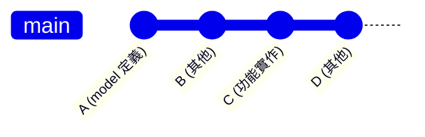
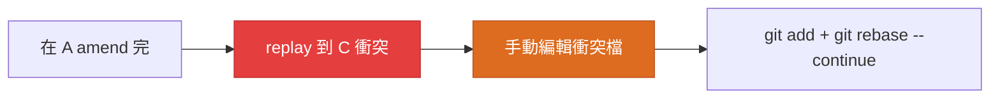

## 問題情境

開發到一半，發現 commit log 裡「實作功能」這個 commit 不只改了功能檔案，還包含了「定義 model」階段的檔案變更。這些變更在開發節奏上應該屬於前面的 commit，但實際上被混在後面的 commit 裡。想把這部分檔案的變更從後面那個 commit 抽出來，合併到前面的 commit 裡，**其他檔案保持原狀**。

### 範例



**四個 commit 的角色**：

- **A**（接收目標）：commit C 中對 `models/foo.dart` 的修訂應該屬於這裡
- **B**（中間插入）：A 跟 C 之間有別的 commit，不能簡單 squash
- **C**（變更來源）：同時改了 `models/foo.dart` 和其他 6 個檔案
- **限制**：只想搬走 `models/foo.dart`，其他檔案保持原狀

---

## 解法核心

這個方法的核心靠 **3-way merge 自動跳過重複變更** — 不需要手動從 C 移除檔案變更，git 會自己偵測「這個變更已在新 base」自動處理。

具體利用兩個 git 機制：

1. **`git rebase -i` 搭配 `edit`**：在指定 commit 暫停，讓我們手動修改該 commit 的內容
2. **3-way merge 自動 dedup**：當後續 commit 被 replay 時，git 比較三個版本（base / theirs / mine），發現該檔案變更已在 mine 裡，就自動跳過

### 為什麼是這個方法

其他可能方案的成本：

- **`git cherry-pick` 後手動解衝突**：cherry-pick 會把整個 commit（包含所有檔案）複製到 A 後面，然後再手動移除不需要的變更。多出一個 commit，且流程較長
- **用 `git format-patch` 提取單一檔案**：format-patch 提取的是整個 commit 的 patch，無法只選擇某個檔案。需要手動編輯 patch 檔，失敗風險高
- **直接 `git add -p` 重新 commit**：需要回到 A 後重新手動 commit 一遍，工作量大且容易遺漏

這個方法的優勢：**自動化程度最高** — 只需在 A 和 C 時暫停，git 會在 replay C 時自動判斷哪些變更要跳過，無需手動識別衝突或編輯 patch。

---

## 步驟

### 1. 建立備份 tag

歷史改寫前先綁 tag，這樣如果出現預期外的結果可以快速復原。

```bash
git tag backup-before-rebase HEAD
```

### 2. 進入 interactive rebase，把 A 跟 C 都標成 edit

從 A 的父 commit 開始 rebase，並把 A 跟 C 都標為 `edit`：

```bash
# 用環境變數注入「自動把 pick 改成 edit」的 sequence editor
GIT_SEQUENCE_EDITOR='sed -i.bak \
  -e "s/^pick \(<A短hash>\)/edit \1/" \
  -e "s/^pick \(<C短hash>\)/edit \1/"' \
GIT_EDITOR=true \
git rebase -i <A短hash>^
```

> macOS 的 `sed -i` 需要加空字串引數（`-i ''`）或像上面用 `-i.bak` 留 backup 檔。
> Linux 的 `sed -i` 不需要。
> 如果更放心用編輯器手動操作，可以拿掉 `GIT_EDITOR=true`，讓 rebase 開你慣用的編輯器手動把兩行的 `pick` 改成 `edit`。

執行後 git 會在 A 暫停。

### 3. 在 A：把 C 中該檔案的版本拉進來，amend

```bash
# 把 C 那個 commit 對該檔案的最終內容 checkout 到工作區
git checkout <C短hash> -- path/to/file.dart

# 加入並 amend 到 A
git add path/to/file.dart
git commit --amend --no-edit

# 繼續
git rebase --continue
```

> `git checkout <commit> -- <path>` 會把指定 commit 的該檔案版本放進工作區。
> 因為 A 是 C 的祖先，C 的版本就是「A 的版本 + C 的 diff」，等於把 C 對該檔案的變更搬到 A。

### 4. 在 C：確認 git 自動跳過該檔案的變更

rebase 繼續後會 replay B、然後在 C 暫停（因為我們也把它標成 edit）。
此時該檔案對 C 的變更應該已被 git 自動跳過，驗證一下：

```bash
git show HEAD --stat
git diff HEAD~ HEAD -- path/to/file.dart
```

第一個指令的檔案清單**不應該再出現** `path/to/file.dart`，第二個指令應該是空輸出。

驗證無誤後，git 已自動完成跳過，直接繼續：

```bash
git rebase --continue
```

> **3-way merge 為什麼會自動跳過？**
> Replay C 時 git 用 3-way merge：
> - **base**（C 的原始父 commit）：該檔案沒變
> - **theirs**（C 原始版本）：該檔案有 X 變更
> - **mine**（amend 後的 A 接續而來的目前 HEAD）：該檔案已經有 X 變更
>
> mine 跟 theirs 的最終狀態一致 → git 認定變更已套用，replay 後的 C 對該檔案就是 no-op。

### 5. 驗證最終樹狀態跟備份一致

最關鍵的 sanity check：**內容不應該變，只是 commit 邊界移動**。

```bash
git diff backup-before-rebase HEAD
```

**輸出必須是空的**。非空就代表有東西被吃掉或多出來，立刻回滾：

```bash
git reset --hard backup-before-rebase
```

確認沒問題後刪 tag：

```bash
git tag -d backup-before-rebase
```

---

## 完整指令摘要

```bash
# 0. 備份
git tag backup-before-rebase HEAD

# 1. Rebase，把 A 與 C 都標 edit
GIT_SEQUENCE_EDITOR='sed -i.bak \
  -e "s/^pick \(<A短hash>\)/edit \1/" \
  -e "s/^pick \(<C短hash>\)/edit \1/"' \
GIT_EDITOR=true \
git rebase -i <A短hash>^

# 2. 在 A：拉檔案、amend、繼續
git checkout <C短hash> -- path/to/file.dart
git add path/to/file.dart
git commit --amend --no-edit
git rebase --continue

# 3. 在 C：驗證、繼續（不需要動手）
git show HEAD --stat
git rebase --continue

# 4. 驗證樹一致
git diff backup-before-rebase HEAD   # 應為空

# 5. 清理
git tag -d backup-before-rebase
```

---

## 衍伸：當變更區段在 A 跟 C 重疊

如果 A 跟 C 對該檔案動的是**同一個區段**（不是這個範例的 non-overlapping），
3-way merge 會跳出衝突，需要手動編輯。流程：



**衝突解決原則**：保留 A 已經帶過去的版本（也就是 C 想再套一次但其實一樣的內容），
讓 C 對該檔案的這次 replay 變成 no-op。

---

## 注意事項

- **改寫已 push 的歷史需要 force push**：用 `git push --force-with-lease` 比 `--force` 安全，
  別人有新 commit 推上去時會被擋住，避免覆寫
- **沒 push 的 commit 改起來無風險**：怎麼操作都只影響本地
- **改寫 main / master 是禁忌**，這個技術只適用於 feature branch
- **codegen 檔案**：如果 `.freezed.dart` / `.g.dart` 等是被 gitignore 的，重組 source commit 後本地需要重跑 build_runner。如果 codegen 也在版控，建議連同 source 一起搬，否則 source 跟 codegen 對不齊
- **Sequence editor 自動腳本**搞不定的話，拿掉 `GIT_EDITOR=true`，讓 rebase 開你慣用的編輯器手動改 `pick` → `edit`，更直觀
- **驗證樹一致性**是這個工作流程的安全網。每次重組完一定要 `git diff backup HEAD` 跑一次
