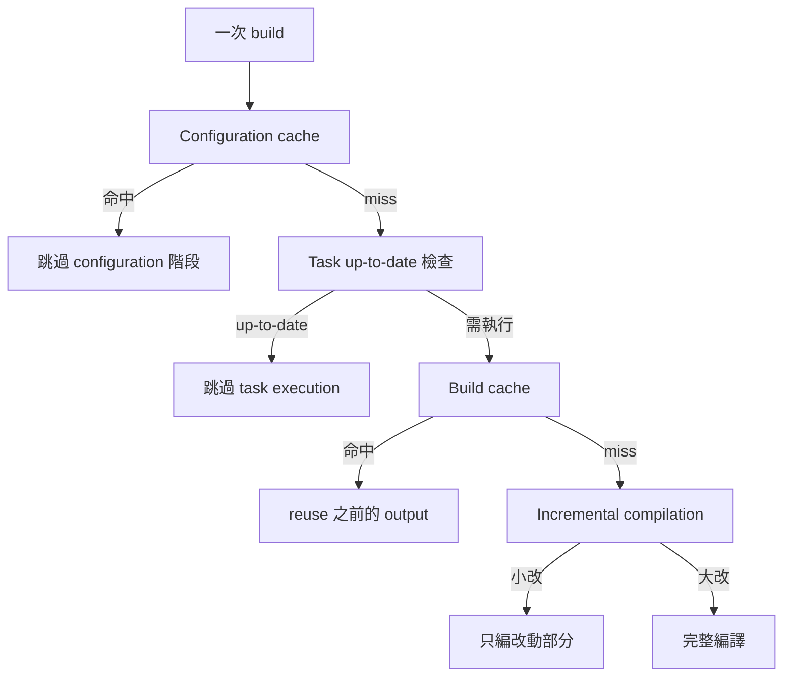

## 問題情境

一個典型描述：

> 「我在 feature branch 開發都沒問題，合併到 main 之後 build 就爆了。但合併前 main 也沒這個錯誤。」

直覺反應會是「合併帶進來什麼壞東西」，但實際除錯後會發現：**根因在幾個月前就存在，合併只是觸發條件**。

---

## 先檢查直覺：真的是這次合併造成的嗎？

### 步驟 1：確認根因 commit

看具體錯誤訊息。例如 JVM target inconsistency，去找兩個關鍵時間點：

```bash
# JVM target 升級的 commit
git log --oneline --all -p -- android/app/build.gradle | grep -B1 "jvmTarget"

# Kotlin plugin 版本升級的 commit
git log --oneline --all -p -- android/settings.gradle | grep -B1 "kotlin"

# 問題 plugin 引入的 commit
git log --all --oneline -p -S "problematic_plugin" -- pubspec.yaml
```

三個時間點疊起來就能看出地雷是什麼時候埋下的。

### 步驟 2：確認地雷埋好後有幾次成功 build

```bash
git log --since="<地雷埋下的日期>" --oneline -- android/
```

如果清單裡有好幾個 commit，其中有些是 CI 或本地曾經成功 build 的，代表**地雷埋下後確實 build 過、卻沒炸**。這就是 cache 掩蓋的證據。

### 步驟 3：確認合併帶進的改動

```bash
git show --stat <合併 commit>
```

看改到什麼檔案。關鍵檢查：

- `pubspec.lock`、`pubspec.yaml` → 會讓 Gradle 重新 resolve 依賴
- `android/*.gradle` → 直接改 build script
- `.gradle/` 或 `build/` 目錄被清過 → cache 失效

這三類任何一項存在都可能打破 configuration cache。

---

## Gradle 的四層快取掩蓋機制

### 四層 cache 各自掩蓋什麼



**每一層都能掩蓋不同的問題**：

| Cache | 掩蓋的情境 |
|---|---|
| Configuration cache | 跳過 build script 重跑，所以 `tasks.withType(...)` 內的 validation 不會再跑 |
| Task up-to-date | plugin 的 `.class` 已存在，整個 compile task skip，validation 也跳過 |
| Build cache | 從其他機器或之前的 build 拉 output，完全不編譯 |
| Incremental | 只編改動的 source 檔，新加的 validation 若沒影響到改動檔就不觸發 |

### Cache 失效的觸發條件

| Cache | 失效 trigger |
|---|---|
| Configuration cache | build script 改動、依賴 resolution 結果變、Gradle 版本變 |
| Task up-to-date | input 檔改動、task 的 configuration 改動 |
| Build cache | cache key 改（input hash 變） |
| Incremental | compiler 認為需要重跑 |

`pubspec.lock` 改動會打破 configuration cache 和 dependency resolution cache，這就是合併後最常見的引爆點。

---

## 為什麼 Kotlin 2.2 的 validation 會被 cache 掩蓋

這次的具體案例：

1. **T1**：專案初始化，引入 `flutter_broadcasts_4m`，plugin 的 `build.gradle` 硬寫 `jvmTarget = '1.8'`
2. **T2**：升級 Kotlin 1.8.22 → 2.2.10（strict validation 從此 enabled）
3. **T3**：升級 `:app` 的 JVM target 1.8 → 17

從 T3 開始，理論上每次 build 都應該觸發 validation 炸掉。但實際上：

- 升級當下的 build：可能在本地用 `./gradlew --stop` 重啟過 daemon，有一次完整 configuration，validation 觸發 → 但因為「一次」而工程師沒記錄下來
- 更可能：升級時恰好在 CI 跑過一次綠燈（因為 CI cache），之後所有 local build 都吃 configuration cache 跳過 validation

後續幾個月：

- 每次 build 靠 configuration cache 或 task up-to-date 跳過 validation
- 地雷一直存在但看不見
- 合併 PR 改到 `pubspec.lock` → configuration cache 失效 → validation 終於被執行 → 爆炸

---

## 診斷流程

### 步驟 1：判斷「根因」vs「觸發條件」

錯誤訊息說的是**當下的症狀**，不一定是真正的根因。用 git log 回溯：

```bash
# 找寫死有問題設定的 plugin 是何時引入的
git log --all -p -S "jvmTarget = '1.8'" -- pubspec.yaml

# 找讓 strict validation 生效的配置變更
git log --all -p -- android/settings.gradle
```

如果這些 commit 都比當前合併早很多，就能確認「根因早存在，合併只是觸發」。

### 步驟 2：判斷 cache 類型

執行無快取 build，看錯誤會不會重現：

```bash
./gradlew clean
./gradlew --stop                           # 停掉 daemon
rm -rf .gradle build                       # 清 project-level cache
# ~/.gradle/caches/ 也可以清但會很慢
flutter clean
flutter build apk --no-build-cache
```

如果這樣 build 還會爆 → 確認是真實問題，不是 cache 偶發
如果這樣 build 不會爆 → cache 掩蓋的真實問題已被解決，之前只是殘留 state 問題

### 步驟 3：驗證修復後不會復發

修復後，在**乾淨環境**下跑過一次完整 build：

```bash
flutter clean
rm -rf ~/.pub-cache/hosted/pub.dev/<problem_plugin>-*
flutter pub get
cd android && ./gradlew clean && ./gradlew build
```

避免「修好但實際還是靠 cache 蓋著」的假綠燈。

---

## 防禦：讓潛伏問題提早暴露

### 方法 1：CI 定期跑無快取 build

排程一週一次的 CI job，跑完整清除 cache 後的 build：

```yaml
# 偽 CI 腳本
- flutter clean
- rm -rf ~/.gradle/caches/modules-2/metadata-*
- cd android && ./gradlew --no-configuration-cache --no-build-cache clean assembleDebug
```

這樣 catch 到的錯誤通常比開發者自己遇到早一週到一個月，能在觸發條件（合併、升級）發生之前就看到。

### 方法 2：升級依賴時強制全量驗證

每次升 Flutter、AGP、Kotlin plugin 版本時，遵守以下流程：

1. 建立升級分支
2. 升級前先 `flutter clean` + `./gradlew clean`
3. 升級後再跑一次無 cache build
4. 確認綠燈才合併

這一步常被忽略，因為「升版本的 PR 通常 diff 很小，看起來不會壞什麼」。但 Gradle 的 strict validation 規則通常就藏在這些小升級裡。

---

## 除錯思維的關鍵切換

看到「branch 上沒事、merge 後爆」這類時序弔詭時：

**不要先想「這次合併改了什麼造成問題」**
→ 容易把時間花在閱讀無關的 diff

**要先想「是不是有什麼東西一直被 cache 蓋著」**
→ 把 cache 當成嫌疑人，去找觸發條件

通常結論都會是：**根因在幾個月前埋下，cache 蓋了很久，這次合併剛好扣扳機**。

把這個思維框架套用在其他類似症狀上也成立：

- CI 一直綠燈，某次合併後才紅 → CI 的 cache 在那次被打破
- 某個開發者電腦上沒事，別人電腦上爆 → 兩台機器的 cache state 不同步
- 升級後立刻 build 綠，過幾天才出問題 → 那幾天有某個動作打破了 cache
