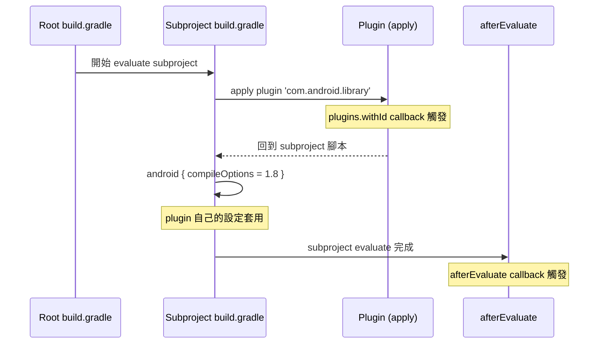
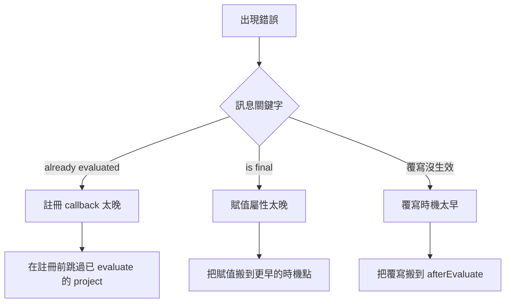

## 三種典型錯誤都源自同一個問題

這些錯誤表面訊息不同，但根本原因都是「callback 註冊得太晚，或屬性被賦值得太晚」：

| 錯誤訊息 | 實際含義 |
|---|---|
| `Cannot run Project.afterEvaluate(Closure) when the project is already evaluated` | 對象已 evaluate 完，註冊 callback 失敗 |
| `The value for property 'languageVersion' is final and cannot be changed any further` | 屬性已被 finalize，後續賦值失敗 |
| 覆寫了 plugin 設定但沒生效 | 覆寫時機早於 plugin，被 plugin 蓋回去 |

想正確治理這些情境，必須先理解 Gradle configuration 的時序模型。

---

## Gradle Configuration 階段的時序

### 單一 project 的 evaluate 流程



**關鍵時機**：

1. `subprojects {}` block 的內容：最早執行
2. `plugins.withId("...") { ... }` callback：plugin apply 那一刻觸發
3. plugin 自己 build.gradle 內的設定（例如 `android { ... }`）：在 3 之後
4. `afterEvaluate { ... }` callback：subproject evaluate 完畢後觸發
5. `tasks.withType(...).configureEach { ... }`：task realize/configure 時才套用

**要覆寫某個設定，必須讓覆寫的時機晚於那個設定的寫入時機。**

### 多 project 的順序

預設情況 Gradle 自己決定 subproject 的 evaluation 順序（通常按字典序）。但若有：

```groovy
subprojects {
    project.evaluationDependsOn(":app")
}
```

`:app` 被強制**最先**完成 evaluate。這是為了讓其他 subproject 能看到 `:app` 的 extension 值，但副作用是：**對 `:app` 來說，後面所有 `subprojects {}` 內的 hook（尤其是 `afterEvaluate`）註冊時機都太晚了**。

---

## 錯誤 1：`Cannot run Project.afterEvaluate when already evaluated`

### 症狀

```groovy
subprojects {
    afterEvaluate {
        if (project.name != 'app') {
            // 想對非 app 的 subproject 做事
        }
    }
}
```

build 時拋錯，指著 `afterEvaluate` 那一行。

### 邏輯推論

- `afterEvaluate(Closure)` 是**註冊動作**，註冊當下就執行
- `subprojects {}` 對每個 subproject 都執行一次，包括 `:app`
- 當處理到 `:app` 時，它已經 evaluate 完畢（因為 `evaluationDependsOn`）
- 對已 evaluate 的 project 註冊 `afterEvaluate` → 註冊失敗 → 拋錯

把 `project.name != 'app'` 放在 closure **內**救不了——`afterEvaluate` 方法本身已經先炸。

### 解法

判斷必須提前到註冊動作之外：

```groovy
subprojects {
    if (project.name != 'app') {
        afterEvaluate {
            // 此時 :app 根本不會進到這裡
        }
    }
}
```

### 更穩健的通用寫法

若不想 hardcode 名字：

```groovy
subprojects {
    if (!project.state.executed) {
        afterEvaluate { ... }
    } else {
        // 對已 evaluate 的 project 立即執行（如果適用）
    }
}
```

---

## 錯誤 2：`languageVersion is final and cannot be changed any further`

### 症狀

在 `subprojects {}` 內嘗試為所有 Kotlin Android 子專案套用 JVM Toolchain：

```groovy
subprojects {
    plugins.withId("org.jetbrains.kotlin.android") {
        kotlin {
            jvmToolchain(17)
        }
    }
}
```

某個 subproject evaluate 時拋錯。

### 邏輯推論

- `plugins.withId` callback 在 plugin apply 那一刻觸發
- 但 Kotlin plugin 的部分屬性在**另一個更早的時機**就被 finalize（例如 plugin 自己內部的 lazy property initialization）
- `jvmToolchain(17)` 想寫入 `languageVersion` 這類屬性，發現已 finalize
- Gradle 的 Provider API 對已 finalize 的屬性再賦值會直接 throw

### 診斷

看錯誤訊息最後幾個字：`is final and cannot be changed any further`。這是 Gradle Provider API 的通用訊息，指向「lazy property 被 finalize 後無法修改」。

**不要**去找「誰把它 finalize 了」——這通常是 plugin 內部實作細節，追不到根因。

**要**找：「有沒有更早的時機點可以設定這個？」

### 解法

把 toolchain 設定往前搬到 `:app/build.gradle` 的頂層（而不是在 root 的 subprojects 內延遲套用）：

```groovy
// :app/build.gradle
kotlin {
    jvmToolchain(17)
}
```

Flutter 專案的 `:app` 是 root configuration 最早執行的 subproject，這個時機點還沒人會 finalize Kotlin plugin 的屬性。

Gradle 會用 `:app` 的 toolchain 決定整個 daemon 用哪個 JDK，其他 subproject 繼承這個 JDK 環境，不需要自己再宣告 toolchain。

---

## 錯誤 3：覆寫了 plugin 設定卻沒生效

### 症狀

在 root `build.gradle` 寫了：

```groovy
subprojects {
    plugins.withId("com.android.library") {
        android {
            compileOptions {
                sourceCompatibility = JavaVersion.VERSION_17
                targetCompatibility = JavaVersion.VERSION_17
            }
        }
    }
}
```

但第三方 plugin（例如 `external_display`）仍然用 JVM 1.8 編譯。

### 邏輯推論

回到時序圖：

| 順序 | 執行內容 |
|---|---|
| 1 | `subprojects {}` 內的 `plugins.withId` callback 註冊 |
| 2 | subproject build.gradle 開始執行 |
| 3 | plugin 被 apply → `plugins.withId` callback 觸發（這裡設 17） |
| 4 | plugin build.gradle 繼續執行 → `android { compileOptions = 1.8 }` |

第 4 步晚於第 3 步，覆蓋了我們的 17。

### 解法

把覆寫時機搬到第 4 步**之後**：

```groovy
afterEvaluate {
    android {
        compileOptions {
            sourceCompatibility = JavaVersion.VERSION_17
            targetCompatibility = JavaVersion.VERSION_17
        }
    }
}
```

`afterEvaluate` 的 callback 在 subproject 的 build.gradle 整個執行完畢後觸發，此時 plugin 已經寫完 `compileOptions = 1.8`，我們再蓋回 17 就贏了。

---

## 除錯決策樹

遇到 configuration 階段的時序錯誤時：



三個解法方向完全相反：

- **太晚** → 提前
- **太早** → 延後

所以看到錯誤時第一件事是判斷**時機太早還是太晚**，而不是試圖繞過屬性狀態。

---

## 判斷「時機太早還是太晚」的速查

| 現象 | 時機狀態 | 該往哪搬 |
|---|---|---|
| callback 註冊失敗（already evaluated） | 太晚 | 提前，或跳過已 evaluate 的對象 |
| 屬性賦值失敗（is final） | 太晚 | 提前到屬性 finalize 之前的 hook |
| 我設的值被蓋掉 | 太早 | 延後到對方設定之後（通常是 afterEvaluate） |
| task 上設了值但沒生效 | 取決於 plugin | 看 plugin 有沒有從 extension 同步的機制 |
