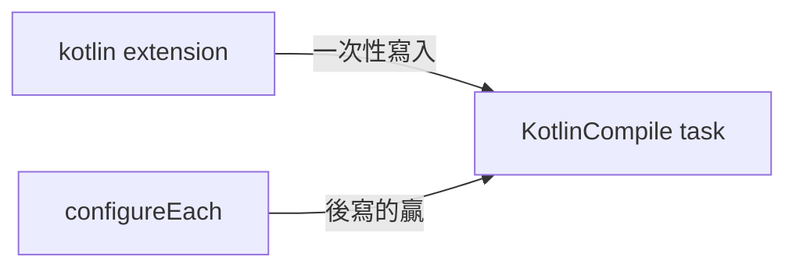
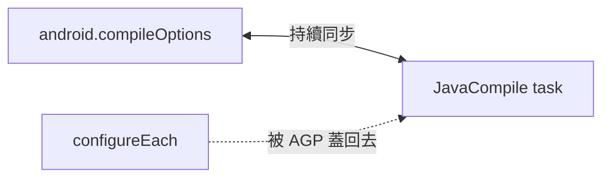

## 問題情境

Android Flutter 專案升到 Kotlin 2.2 + AGP 8.12 後，build 時出現：

```text
Execution failed for task ':external_display:compileDebugKotlin'.
> ⛔ Inconsistent JVM Target Compatibility Between Java and Kotlin Tasks
  Inconsistent JVM-target compatibility detected for tasks
  'compileDebugJavaWithJavac' (1.8) and 'compileDebugKotlin' (17).
```

主專案 `:app` 已經設定 JVM 17，但第三方 plugin（例如 `external_display`）的 `build.gradle` 硬寫死 JVM 1.8。想從主專案這邊強制覆寫，卻發現 Kotlin 用一種寫法能贏、Java 用同樣的寫法卻會輸。

---

## Kotlin 與 Java 的覆寫結果不一樣

### Kotlin 端：task 級 configureEach 能贏

```groovy
subprojects {
    tasks.withType(org.jetbrains.kotlin.gradle.tasks.KotlinCompile).configureEach {
        kotlinOptions {
            jvmTarget = '17'
        }
    }
}
```

即使 plugin 的 build.gradle 寫了 `kotlinOptions { jvmTarget = '1.8' }`，這段覆寫仍然會贏。

### Java 端：task 級 configureEach 會被蓋回去

```groovy
subprojects {
    tasks.withType(JavaCompile).configureEach {
        sourceCompatibility = '17'
        targetCompatibility = '17'
    }
}
```

這段看起來跟 Kotlin 端對稱，但沒用 —— task 上的賦值會被 AGP 從 `android.compileOptions` 再同步回來，重新變成 1.8。

---

## 為什麼不對稱：兩個 plugin 的內部機制不同

### Kotlin Plugin：extension → task 單向流動

Kotlin plugin 讀取 `kotlin {}` 或 `kotlinOptions {}` extension 的值，寫入對應的 `KotlinCompile` task。**寫入一次，之後不再同步**。



這就是為什麼 `configureEach` 能贏 —— 它註冊的 configuration action 在 task realization 時才套用，比 plugin 的 extension 寫入更晚。

### AGP：extension ↔ task 雙向同步

AGP 把 `android.compileOptions.sourceCompatibility` 視為**真相來源**，每次 JavaCompile task 被 realize 或 configure 時，都會從 extension 重新同步過去。



在 task 上直接賦值沒用 —— AGP 會用 extension 的值把你蓋掉。真正有效的治理點是 **extension 本身**。

---

## 正確解法：切入點依 plugin 機制決定

### Kotlin：鎖 task

```groovy
tasks.withType(org.jetbrains.kotlin.gradle.tasks.KotlinCompile).configureEach {
    kotlinOptions {
        jvmTarget = '17'
    }
}
```

### Java：鎖 extension，而且要在 `afterEvaluate` 時機

直接在 `subprojects {}` 最外層寫 `plugins.withId("com.android.library") { android { compileOptions {...} } }` **也沒用**：這個 callback 在 plugin 被 apply 時立刻觸發，早於 plugin 自己的 build.gradle 執行，會被 plugin 後來的 `android { compileOptions = 1.8 }` 蓋回去。

必須等 plugin 自己的 `android {}` 執行完之後再改，也就是 `afterEvaluate`：

```groovy
subprojects {
    if (project.name != 'app') {
        afterEvaluate {
            if (project.hasProperty('android')) {
                android {
                    compileOptions {
                        sourceCompatibility = JavaVersion.VERSION_17
                        targetCompatibility = JavaVersion.VERSION_17
                    }
                }
            }
        }
    }
}
```

---

## 診斷流程

遇到 JVM target inconsistency 錯誤時，照以下步驟推論：

### 步驟 1：看錯誤訊息指的是哪個 task

```text
Inconsistent JVM-target compatibility detected for tasks
'compileDebugJavaWithJavac' (1.8) and 'compileDebugKotlin' (17).
```

- `compileDebugJavaWithJavac` 是 Java 端的 task
- `compileDebugKotlin` 是 Kotlin 端的 task
- 括號內的數字就是各自的 target

### 步驟 2：看哪一端低、哪一端高

- **低的那端被 plugin 硬寫死了**
- **高的那端是主專案設定已經生效的**

這一步決定要覆寫哪一端。

### 步驟 3：看是哪個 plugin 引起的

從錯誤訊息的 task 前綴 `:external_display:compileDebugKotlin` 找到是 `external_display` plugin。

查它的 `build.gradle`：

```bash
find ~/.pub-cache/hosted/ -type d -name "external_display*"
cat ~/.pub-cache/hosted/pub.dev/external_display-0.4.2+1/android/build.gradle
```

通常會看到：

```groovy
compileOptions {
    sourceCompatibility JavaVersion.VERSION_1_8
    targetCompatibility JavaVersion.VERSION_1_8
}
kotlinOptions {
    jvmTarget = '1.8'
}
```

### 步驟 4：依 Kotlin/Java 差異選擇覆寫方式

- Kotlin 寫死 → 用 `KotlinCompile.configureEach`
- Java 寫死 → 用 `afterEvaluate` 改 `android.compileOptions`

---

## 完整的 root `android/build.gradle` 範例

```groovy
subprojects {
    // Java 端：在 plugin 的 android {} 執行完後覆寫 compileOptions
    if (project.name != 'app') {
        afterEvaluate {
            if (project.hasProperty('android')) {
                android {
                    compileOptions {
                        sourceCompatibility = JavaVersion.VERSION_17
                        targetCompatibility = JavaVersion.VERSION_17
                    }
                }
            }
        }
    }
    // Kotlin 端：task 級直接覆寫
    tasks.withType(org.jetbrains.kotlin.gradle.tasks.KotlinCompile).configureEach {
        kotlinOptions {
            jvmTarget = '17'
        }
    }
}
```

`:app` 跳過是因為它透過 `kotlin { jvmToolchain(17) }` 自己處理了（見下節）。

---

## 延伸：為什麼 `:app` 不能用同一套覆寫

若專案的 root `build.gradle` 裡有：

```groovy
subprojects {
    project.evaluationDependsOn(":app")
}
```

這行強制 `:app` 比所有其他 subproject 先 evaluate。等到 `subprojects { afterEvaluate {} }` 想註冊到 `:app` 時，`:app` 已經 evaluate 完畢，Gradle 拋：

```text
Cannot run Project.afterEvaluate(Closure) when the project is already evaluated.
```

所以要在呼叫 `afterEvaluate` 之前用 `project.name != 'app'` 跳過它。
`:app` 的 JVM 設定交給 `:app/build.gradle` 自己處理，例如：

```groovy
kotlin {
    jvmToolchain(17)
}
```
