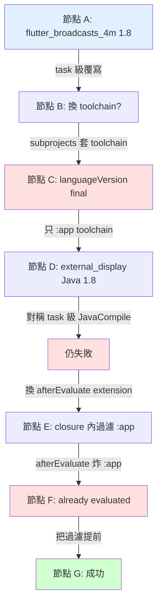

## 為什麼寫這篇

排查 Gradle JVM target inconsistency 時走了七個節點才收斂。這篇復盤每個節點的完整決策流：


---

## 節點 A：第一次錯誤出現

### 當下看到

```text
Execution failed for task ':flutter_broadcasts_4m:compileDebugKotlin'.
> ⛔ Inconsistent JVM Target Compatibility Between Java and Kotlin Tasks
  detected for tasks 'compileDebugJavaWithJavac' (17)
  and 'compileDebugKotlin' (1.8).
```

### 判讀

**這類錯誤在系統中代表什麼**（商業邏輯）：

Android 專案的每個 module（主 app 或第三方 plugin）會分別編譯 Java 跟 Kotlin 原始碼，各自產出 JVM bytecode。每個 bytecode 檔案有一個「target version」，決定它能在多舊的 JVM runtime 上執行，以及可以使用哪些語言特性。

同一個 module 內的 Java 跟 Kotlin 若產出不同 target 的 bytecode，執行時可能踩到 API 相容性問題（例如 Java 17 的 class 呼叫到 Kotlin 1.8 runtime 不存在的方法）。Kotlin 2.2 把這個原本只是 warning 的情境提升為 strict error，直接中止 build。

所以 `Inconsistent JVM Target Compatibility` 這類錯誤的本質是：**某個 module 裡面 Java 跟 Kotlin 編譯產出的 bytecode 不是同一個版本**。

**這次訊息具體說了什麼**（CASE）：

- 錯誤 task 前綴 `:flutter_broadcasts_4m` → 出問題的 module 是這個第三方 plugin
- `compileDebugJavaWithJavac (17)` → 這個 module 的 Java 編譯產出 bytecode target = 17
- `compileDebugKotlin (1.8)` → 這個 module 的 Kotlin 編譯產出 bytecode target = 1.8
- 17 跟 1.8 不同 → 符合上面「module 內不一致」的 pattern

**從 CASE 推論的事**：

- 主專案 `:app` 已設定 JVM 17，這個 plugin 的 Java 繼承到 17；但 Kotlin 被某處明確設成 1.8
- Kotlin plugin 的預設值會跟 Java 對齊，所以 1.8 是「有人明確寫了」，不是預設
- 最有可能的「有人」是 plugin 自己的 `build.gradle`

**需要進一步確認才能完整判讀的**：

- Kotlin 1.8 具體寫在哪？`cat ~/.pub-cache/hosted/pub.dev/flutter_broadcasts_4m-*/android/build.gradle` 可以驗證
- 其他 plugin 有沒有同類寫死？這不影響當前這個錯誤的修復，但影響**修復範圍**的完整性

**判讀後的問題類別**：

- 類別：第三方 plugin 內部寫死 JVM target
- 主專案的 override 機制沒能覆蓋到 plugin 的內部設定

**這次判讀的完整度**：驗證了 plugin 內部寫死（確認過 `kotlinOptions { jvmTarget = '1.8' }`），但**沒有擴大搜尋其他 plugin**。這個不完整後來在節點 D 付出代價。

### 可選策略

**A1. 等 plugin 升級**
- 優點：零維護；無需理解 Gradle 機制
- 缺點：決策權不在自己；無法保證 plugin 作者會修

**A2. 從 root 專案強制覆寫**
- 優點：決策權自主；影響範圍可控；不需 fork
- 缺點：需要理解 Gradle 生命週期

**A3. Fork plugin 修改**
- 優點：覆蓋完整；可修改任何細節
- 缺點：持續維護成本；升級需 merge;增加依賴來源複雜度

**A4. 降 `:app` 回 JVM 1.8**
- 優點：不需額外配置
- 缺點：放棄 Java 17 語言特性；跟 AGP 方向相反

### 選擇與理由

**A2**。A1 放棄決策權；A3 維護成本跟 plugin 重要性不成比例；A4 機會成本太高。

### 修正動作

```groovy
subprojects {
    plugins.withId("com.android.library") {
        android {
            compileOptions {
                sourceCompatibility = JavaVersion.VERSION_17
                targetCompatibility = JavaVersion.VERSION_17
            }
        }
    }
    tasks.withType(org.jetbrains.kotlin.gradle.tasks.KotlinCompile).configureEach {
        kotlinOptions { jvmTarget = '17' }
    }
}
```

### 結果

`flutter_broadcasts_4m` 過了。

### 事後檢視

判讀階段明確知道「需要進一步確認其他 plugin 是否有同類問題」，但沒做。當下沒做的理由是「目前錯誤訊息只指向這一個 plugin」，這個理由把判讀完整性降到最低——**修復只要能讓當前這次 build 過就好**。

若判讀時把「範圍完整性」當成跟「修復正確性」同等的維度：

- 會額外做一次 `grep -r "jvmTarget" ~/.pub-cache/hosted/pub.dev/*/android/build.gradle | grep "1.8"`
- 會得到一份完整的有同類問題的 plugin 清單
- 修復策略 A2 就會涵蓋整份清單，不只當前一個

這裡不是選錯了策略，是**判讀時把範圍當成「訊息指定的」而非「應該主動探索的」**。

---

## 節點 B：使用者問「要不要換 JVM Toolchain」

### 當下看到

節點 A 修復成功。使用者提出：「既然官方推薦 JVM Toolchain，A2 的 task 級 configureEach 是不是次佳解？」

### 判讀

這不是錯誤訊息，是**當前方案跟官方推薦方向的差距**。

**這類判斷的商業邏輯**：

Gradle 有兩種層次不同的 JVM 治理機制，判斷「要不要換」之前要先理解它們處理的是不同問題：

- **編譯輸出控制**：決定「編譯出來的 bytecode target 是多少」。影響產出的 `.class` 檔能在哪個 JVM runtime 上跑，但不管 Gradle 自己用什麼 JDK 執行。
- **JDK 工具鏈管理**：決定「Gradle 執行編譯器時用哪一版 JDK」。不同 JDK 會影響編譯行為、支援的語言特性、以及一些 bytecode 預設目標。

這兩件事可以獨立設定。一個專案可以用 JDK 21 執行 Gradle，但編譯產出 JVM 17 bytecode（為了向下相容）。

所以「要不要換 toolchain」這個問題的本質是：**這兩層治理機制現在各自的解決方式是否對當前需求最佳？**

**這次的具體選擇空間**（CASE）：

當前方案：`tasks.withType(KotlinCompile).configureEach { jvmTarget = '17' }` task 級 configureEach
- 處理的問題：編譯輸出控制（bytecode target = 17）
- 不處理的問題：JDK 工具鏈管理（開發者本機裝什麼 JDK、版本是否一致未控管）

Toolchain 方案：`kotlin { jvmToolchain(17) }` extension 級
- 處理的問題：JDK 工具鏈管理（Gradle 自動下載 JDK 17 執行）
- 附帶處理：對守規矩的 plugin 也會影響 bytecode target
- 不處理的問題：硬寫死 `jvmTarget = '1.8'` 的 plugin（extension 會被 plugin 的 task 設定蓋掉）

**從 CASE 推論的事**：

這兩個方案**不是替代關係，是不同層次的治理**。task 級覆寫處理「產出」，toolchain 處理「JDK 環境」。兩者可以並存，甚至應該並存。

**需要進一步確認**：

- Toolchain 的 extension 設定是否真會被硬寫死的 plugin 蓋掉？（答案是：會被蓋掉，但節點 B 當下沒驗證）
- Toolchain 能在哪些時機點設定？（答案：某些屬性在 plugin apply 的 lazy initializer 時 finalize，此時再設會炸——但這也是節點 B 當下沒驗證）

### 可選策略

**B1. 保持現狀（task 級 configureEach）**
- 優點：已經 work
- 缺點：偏離官方方向；每位開發者本機 JDK 需自行管理

**B2. 完全換成 toolchain**
- 優點：符合官方方向；JDK 自動下載
- 缺點：無法覆蓋硬寫死 plugin（extension 會被 plugin 的 task 設定蓋）

**B3. 混合（toolchain + task 級覆寫）**
- 優點：同時享有 toolchain 的 JDK 管理跟 task 級的強制力
- 缺點：配置面向增加

### 選擇與理由

**B3**。B2 單獨不完整，B1 忽略長期適應性，B3 是功能完整的組合。

### 結果

Build 炸：`languageVersion is final`。

### 事後檢視

判讀階段明確列出了「toolchain 能在哪些時機點設定」這個需要確認的問題，但沒確認就進入策略。**判讀的未完成部分就是節點 C 的失敗來源**。

這次判讀告訴了我們「還缺什麼資訊」，但沒有把「缺的資訊」當成進入下一階段的阻擋條件。若判讀的標準是「所有標示為『需要確認』的事實都要先解答」，節點 C 不會發生。

這一步的本質問題不是選錯了 B3，而是**把判讀中的不確定性帶入執行階段**。

---

## 節點 C：`languageVersion is final` 錯誤

### 當下看到

```text
* Where:
Build file '/Users/mac-eric/project/unipos/android/build.gradle' line: 37

* What went wrong:
> The value for property 'languageVersion' is final and cannot be changed any further.
```

### 判讀

**這類錯誤在系統中代表什麼**（商業邏輯）：

Gradle 的許多 configuration 屬性有「生命週期狀態」的概念。一個屬性從建立時可以自由讀寫，但到了某個時機點後會被 **finalize** — 意思是「值從此鎖定，任何後續賦值都會被拒絕」。

Finalize 不是錯誤，是 Gradle 保證 build 可預測性的機制：若某個值已經被使用（被其他 task 讀取、被其他設定依賴），再讓它改變會造成「同一次 build 的上下文裡不同地方看到不同值」的不一致。

觸發 finalize 的時機有很多種，最常見的：
- 其他程式碼讀取了這個屬性
- plugin 內部的 lazy initializer 把值固定下來
- project evaluation 進入某個階段

所以 `is final and cannot be changed any further` 這類錯誤的本質是：**你現在嘗試賦值的屬性，已經在更早的時機被鎖定了**。問題不在「值本身」，在「賦值的時機」。

**這次訊息具體說了什麼**（CASE）：

- 錯誤位置：root `build.gradle` line 37
- line 37 是 `kotlin { jvmToolchain(17) }` 那行
- 被鎖定的屬性：`languageVersion`
- 狀態：已 final，拒絕修改

**從 CASE 推論的事**：

- `jvmToolchain(17)` 內部試圖設定多個屬性，其中 `languageVersion` 已 final
- 「已 final」表示有更早的動作完成了它的 finalize。可能來源：
  - (a) 某個 plugin 在 apply 階段透過 lazy initializer 把值固定下來
  - (b) 某個先前的配置（`kotlinOptions { }` 或類似）把值鎖定
- 這段在 `subprojects {}` 內，會對每個 subproject 執行；**可能不是每個 subproject 都觸發**，是某個特定的

**錯誤訊息沒說但需要推論的**：

- 是**哪個** subproject 觸發？訊息沒指名
- 為什麼 `:app` 先前 `kotlin { jvmToolchain(17) }` 成功，subprojects 內就失敗？

**判讀後的問題類別**：

- 類別：**時機問題** — 設定 `jvmToolchain` 的時機晚於某個 plugin 的 `languageVersion` finalize 時機
- 對照已 work 的 `:app`：`:app` 是在自己的 `build.gradle` 頂層設 toolchain，時機最早
- 差異：subprojects 內的 `plugins.withId` 或 `kotlin {}` 區塊是 callback，執行時機比 `:app` 頂層晚

### 可選策略

**C1. 拿掉 subprojects 的 toolchain，只留 `:app`**
- 優點：`:app` 的 toolchain 驅動整個 Gradle daemon 的 JDK 環境，子專案繼承；避開 finalize 衝突
- 缺點：依賴「Gradle daemon 用 global JDK」這個前提

**C2. 改用 `afterEvaluate` 延遲 toolchain 設定**
- 優點：可能繞過 finalize
- 缺點：afterEvaluate 的時機本身可能更晚，屬性可能更 finalized；且 `:app` 已 evaluate 的情境會引入另一個問題（未預見）

**C3. 回滾 toolchain，完全用 task 級覆寫**
- 優點：最保守；已驗證 work
- 缺點：放棄 toolchain 的 JDK 管理；違反節點 B 的初衷

### 選擇與理由

**C1**。判讀中指出「`:app` 頂層時機最早所以 work」，對應的治理是「只在最早時機點設定」。C1 直接反映這個判讀。

### 結果

`flutter_broadcasts_4m` 繼續通過，但會遇到下一個 plugin。

### 事後檢視

C1 選擇正確，但**支持 C1 的關鍵事實（Gradle daemon 使用 global JDK）是節點 C 當下才被建立的**。若節點 B 判讀階段就補上這個事實，B 階段的「B3 設定方式」會直接選「toolchain 只設在 :app」，節點 C 不會發生。

這一步的決策品質問題不在節點 C，在節點 B 的判讀不完整。

---

## 節點 D：第二個 plugin 爆了

### 當下看到

```text
Execution failed for task ':external_display:compileDebugKotlin'.
> detected for tasks 'compileDebugJavaWithJavac' (1.8)
  and 'compileDebugKotlin' (17).
```

### 判讀

**這類錯誤在系統中代表什麼**（商業邏輯）：

跟節點 A 是同一類錯誤（JVM target 不一致），但要注意**不一致的方向**：「哪一邊高、哪一邊低」決定治理策略。

在覆寫第三方 plugin 的 JVM target 時，每一個 module 有兩個編譯端（Java、Kotlin），每一端都可能被 plugin 寫死或被主專案覆寫。可能的失敗組合是：

- Java 端被 plugin 拉低，Kotlin 端被主專案拉高 → 要覆寫 Java
- Kotlin 端被 plugin 拉低，Java 端被主專案拉高 → 要覆寫 Kotlin
- 兩端都被 plugin 拉低 → 兩端都要覆寫

訊息裡的「低的那端」就是還沒被主專案成功覆寫的那一端，也就是下一步要處理的目標。

**這次訊息具體說了什麼**（CASE）：

- 出問題的 module 換了：是 `:external_display`（不是節點 A 的 `:flutter_broadcasts_4m`）
- 方向跟節點 A **相反**：
  - 節點 A：Java 17 / Kotlin 1.8（Kotlin 低）
  - 現在：Java 1.8 / Kotlin 17（Java 低）

**從 CASE 推論的事**：

- Kotlin 17 表示節點 A 的 `KotlinCompile.configureEach { jvmTarget = '17' }` 對 `:external_display` 也生效了 —— 這條 task 級覆寫不限於單一 plugin
- Java 1.8 表示節點 A 的 `plugins.withId("com.android.library") { android { compileOptions = 17 } }` **沒對 `:external_display` 生效**
- 這段覆寫對 `:flutter_broadcasts_4m` 可能生效（否則 Java 也會是 1.8），也可能是 `:flutter_broadcasts_4m` 的 Java 本來就是 17 沒被寫死
- 需要進一步確認 `:external_display` 的 `build.gradle`：是不是它自己硬寫了 `compileOptions = 1.8`

**驗證判讀（實際做了）**：

```bash
cat ~/.pub-cache/hosted/pub.dev/external_display-0.4.2+1/android/build.gradle
```

確認這個 plugin **兩邊都寫死 1.8**：

```groovy
compileOptions {
    sourceCompatibility JavaVersion.VERSION_1_8
    targetCompatibility JavaVersion.VERSION_1_8
}
kotlinOptions { jvmTarget = '1.8' }
```

**需要進一步推論的**：

- 為什麼節點 A 的 `plugins.withId { android { compileOptions } }` 沒贏過 plugin 的 `android { compileOptions = 1.8 }`？
- 猜測：`plugins.withId` 的 callback 早於 plugin 自己的 `android {}` 區塊，plugin 後寫所以蓋掉
- 但這只是猜測，還沒驗證 AGP 的同步機制

**判讀後的問題類別**：

- 類別：跟節點 A 類似（plugin 寫死），但**覆寫的方向不同**——這次是 Java 端要覆寫
- 節點 A 的 Kotlin 端有 task 級工具（configureEach）可用
- Java 端有沒有對稱的工具？這個判讀**沒有完成**

### 可選策略

**D1. 在 `tasks.withType(JavaCompile).configureEach` 設 source/target**
- 優點：跟節點 A 的 Kotlin 做法結構一致
- 缺點：假設 AGP 的 JavaCompile 跟 Kotlin plugin 的 KotlinCompile 機制對稱，這個假設沒驗證

**D2. 在 `plugins.withId { android { compileOptions } }` 覆寫**
- 優點：用 extension 而非 task
- 缺點：這段已經在檔案內且顯然沒生效（plugin 後來的 `android {}` 蓋掉）

**D3. 用 `afterEvaluate` 改 `android.compileOptions`**
- 優點：時機晚於 plugin 自己的 `android {}`，能確實覆蓋
- 缺點：引入 afterEvaluate 的時序複雜度

**D4. 先查 AGP 文件，確認 JavaCompile 是否能用 task 級覆寫**
- 優點：判讀階段缺失的「Java 端機制」補完，選擇有依據
- 缺點：查證過程有不確定性

### 選擇與理由

**D1**。理由：跟節點 A 的 Kotlin 做法對稱。

**這個選擇的本質問題在判讀階段**。判讀結束時已經留下「Java 端機制未驗證」這個未完成的問題，但策略階段沒把 D4 當成補完判讀的選項，直接用「結構對稱」作為依據跳到 D1。

### 結果

Build 再爆，**完全一樣的錯誤**。

### 事後檢視

D1 的失敗根源是**判讀不完整時就進入策略**。這跟節點 B → C 的失敗模式相同：判讀列出了需要確認的事，但沒確認就決定策略。

對稱假設之所以危險，是因為它**用「結構相似」取代了「機制驗證」**。結構相似是判讀層次的現象（訊息結構類似），機制是底層層次的事實（實作者如何設計）。用前者取代後者，判讀就沒有真正進到底層。

當下若把 D4 視為跟 D1 平行的選項，而且讓判讀的未完成問題成為「必須先解」的前提，會直接跳到 D4 → D3 路徑。

---

## 節點 E：決定改用 afterEvaluate + extension

### 當下看到

D1 失敗，確認 AGP 會從 `android.compileOptions` 同步到 JavaCompile task。要把 Java 端的覆寫改成 extension 級，且要晚於 plugin 自己的 `android {}`。

### 判讀

**這類選擇在系統中代表什麼**（商業邏輯）：

Gradle 的 `method(Closure)` 形式 API（像 `afterEvaluate`、`configure`、`doLast`）都是**兩階段模型**：

1. **註冊階段**：呼叫 `method(Closure)` 時，Gradle 把 closure 記起來，決定「什麼時候執行這個 closure」。這個註冊動作本身會立即執行，若註冊條件不滿足（例如目標物件狀態不對），註冊會直接失敗。
2. **執行階段**：條件觸發時（例如 project evaluate 完成），Gradle 從註冊列表拿出 closure 執行。

這兩個階段的失敗模式不同：註冊失敗是呼叫 `method` 本身拋錯，closure 根本不會執行；執行失敗是 closure 內部拋錯。

所以當我們要對 `method(Closure)` 形式 API 套用**過濾條件**時，要先問：過濾的對象是誰？

- 若要過濾「延遲執行的內容」 → 條件放 closure 內
- 若要過濾「註冊動作本身是否該發生」 → 條件放 `method` 呼叫之前

這不是風格偏好，是「過濾發生在不同階段」。

**這次的具體選擇空間**（CASE）：

寫法 1：`afterEvaluate { if (project.name != 'app') { android { compileOptions } } }`
寫法 2：`if (project.name != 'app') { afterEvaluate { android { compileOptions } } }`

表面上兩者「看起來都跳過 `:app`」。

**把商業邏輯套回 CASE 推論**：

- 寫法 1：過濾在 closure 內 → `afterEvaluate` 本身會對**所有** subproject 呼叫（包括 `:app`）。若 `:app` 狀態不滿足註冊條件，註冊階段就失敗
- 寫法 2：過濾在 `afterEvaluate` 外 → `:app` 根本不會觸發註冊呼叫

哪種寫法正確，取決於**「註冊階段對 `:app` 會不會失敗」**。

**判讀需要問的關鍵問題**：

- `afterEvaluate` 的註冊動作會不會失敗？
- 什麼情況下會失敗？
- 「project 已 evaluate」是不是其中一種？
- `:app` 在當前專案結構下會不會是已 evaluate 狀態？

**這些問題當下沒問**。判讀停留在「兩種寫法看起來一樣」的表面層次，沒有展開到兩階段模型。

### 可選策略

**E1. 過濾放 closure 內**
- 優點：過濾邏輯跟 closure 放一起；讀起來連貫
- 缺點：假設 afterEvaluate 方法呼叫不會失敗

**E2. 過濾放 afterEvaluate 外**
- 優點：阻止 afterEvaluate 方法呼叫本身對有問題的 project 觸發
- 缺點：兩層 if 需要額外理解

**E3. 用 `project.state.executed` 判斷**
- 優點：通用解法，不 hardcode 名字
- 缺點：對這個情境過度設計

### 選擇與理由

**E1**。理由：讀起來連貫。

**這個選擇的本質問題**：判讀沒展開「方法呼叫 vs closure 執行」的兩階段，所以權衡時用「可讀性」這個表面維度決定，沒有觸及「哪個寫法能阻止失敗」這個底層維度。

### 結果

Build 炸：`Cannot run Project.afterEvaluate(Closure) when the project is already evaluated.`

### 事後檢視

E1 vs E2 的真正差異不是「哪個好讀」，是**過濾哪一個執行階段**：

- E1 過濾延遲執行的 closure 內容
- E2 過濾方法呼叫本身

判讀若展開到這個層次，權衡就會變成：「我要過濾的是哪一個階段？」——而這題有明確答案（`:app` 的失敗發生在方法呼叫階段），所以 E2 是唯一正確選項。

判讀不到這個層次 → 兩個選項在決策者眼中「等價」→ 用次要維度（可讀性）決定。

---

## 節點 F：`Cannot run afterEvaluate when already evaluated`

### 當下看到

```text
Cannot run Project.afterEvaluate(Closure) when the project is already evaluated.
```

### 判讀

**這類錯誤在系統中代表什麼**（商業邏輯）：

Gradle 的 project 有生命週期：建立 → 配置中 → **evaluate 完成** → 執行 task。一旦 project 走到「evaluate 完成」狀態，有些動作就再也做不了，因為它們的意義依賴於「evaluate 還沒結束」這個前提。

`afterEvaluate` 是一種「訂閱 evaluate 完成事件」的 API：註冊一個 closure，Gradle 承諾在該 project evaluate 完成時呼叫它。

但如果 project **已經** evaluate 完成，這個承諾無法兌現 — 「evaluate 完成」這個事件已經發生過了，不會再發生第二次。此時再註冊訂閱沒有意義，Gradle 直接拋錯。

所以 `Cannot run Project.afterEvaluate(Closure) when the project is already evaluated` 這類錯誤的本質是：**想訂閱一個已經發生過的事件**。

**這次訊息具體說了什麼**（CASE）：

- `afterEvaluate(Closure)` 這個方法呼叫失敗
- 失敗原因：目標 project 已經 evaluate 完
- 位置：root `build.gradle` line 52（`afterEvaluate` 那行）

**從 CASE 推論的事**：

- 「已 evaluate 完的 project」具體是哪個？訊息沒指名，但從上下文推論：
- 回頭看 root `build.gradle` 上半部有 `subprojects { project.evaluationDependsOn(":app") }`
- 這行強制 `:app` 比其他 subproject 先 evaluate
- 當 `subprojects {}` 的區塊處理到 `:app` 時，`:app` 的 evaluate 已完成 → 對它呼叫 `afterEvaluate` 失敗

**完整推論鏈**：

```
subprojects {} 執行 → 對 :app 呼叫 afterEvaluate(Closure)
→ :app 已 evaluate（因 evaluationDependsOn）→ 訂閱失敗
```

**判讀後的問題類別**：

- 類別：訂閱了一個已發生的事件（註冊時機晚於事件觸發）
- 解決方向：阻止註冊動作對該對象觸發

### 可選策略

**F1. 把 `project.name != 'app'` 提前到 afterEvaluate 外**
- 優點：直接阻止方法呼叫對 `:app` 觸發
- 缺點：hardcode 名字；若 `:app` 改名需修

**F2. 用 `project.state.executed` 條件**
- 優點：通用，不依賴名字
- 缺點：過度設計；`:app` 本來就不需要 subprojects 邏輯管

**F3. `try/catch` 吞掉註冊失敗**
- 優點：程式碼最少
- 缺點：anti-pattern，隱藏失敗

### 選擇與理由

**F1**。F3 是反模式；F2 的通用性在此情境無實際收益。

### 結果

Build 成功。

### 事後檢視

F1 選擇正確。但這個節點若在 E 階段判讀「方法呼叫 vs closure 執行」兩階段時就識別出來，**F 節點本來不會存在**。F 是 E 判讀不完整的延伸結果。

---

## 節點 G：最終修復

- `:app/build.gradle`：`kotlin { jvmToolchain(17) }`
- `android/settings.gradle`：Foojay plugin
- `android/build.gradle` subprojects：
  - Java 端 `afterEvaluate` 改 `android.compileOptions`（跳過 `:app`）
  - Kotlin 端 `KotlinCompile.configureEach`

---

## 把「判讀」當成獨立階段的意義

回看七個節點中四個失敗節點的**失敗來源**：

| 節點 | 失敗類別 | 根本來源 |
|---|---|---|
| 節點 C | 需要新資訊（toolchain 時機） | 節點 B 判讀留下「需要確認」但沒補 |
| 節點 D1 | 對稱假設 | 節點 D 判讀用「結構對稱」取代「機制驗證」 |
| 節點 F | 方法呼叫時機 | 節點 E 判讀沒展開 API 的兩階段行為 |

**三個失敗都源自判讀未完成**。不是策略選錯，是策略階段進入時，判讀本身還帶著未解決的問題。

如果把判讀當成獨立階段，並且**要求判讀階段的所有「需確認」項目在進入策略前都被解答**，這三個失敗都可以避免。

### 判讀完成的標準

一個合理的判讀完成標準：

1. **字面事實都列出來**：訊息裡出現的 task、file、line、屬性名都提取
2. **推論標示**：哪些是從字面事實推論出來的（而非訊息直接寫的）
3. **未確認的問題列清單**：判讀過程中發現「需要進一步確認」的問題，不迴避
4. **未確認的問題在進入策略前解答**：或明確決定「這個問題可以先忽略，理由是...」

多數失敗不是在策略階段「選錯」，是在判讀跟策略之間**帶著未解問題跨界**。

---

## 整個過程的決策品質檢視

### 七個節點四次失敗的分類

**判讀未完成延伸類（三個）**：

- 節點 C（來自 B 的判讀）
- 節點 D1（來自 D 的判讀）
- 節點 F（來自 E 的判讀）

**策略階段發現需要新資訊類（零個）**：

- 所有失敗都可追溯到判讀階段已知的未解問題

**偶然類（零個）**：

- 本次沒有真正「不可預見」的失敗

### 可複用的三個原則

**原則 1：觀察 → 判讀 → 策略 → 執行 是四個獨立階段**

每個階段的目的不同：
- 觀察：把訊息讀清楚
- 判讀：從訊息推出問題本質，列出所有已知、已推論、未確認的事實
- 策略：基於判讀推導選項並權衡
- 執行：實際動作

跳過判讀 → 策略基於不完整資訊；跳過策略 → 執行是直覺反應。

**原則 2：判讀階段的未解問題是進入策略的阻擋條件**

判讀中標示「需要確認」的問題，要麼在進入策略前補完，要麼明確決定「可以忽略，理由是...」。不能帶著未解問題進策略。

**原則 3：單點成功後擴大觀察範圍**

每個節點結束後，判讀應擴展：「還有哪些地方可能有同類問題？」當前修復是否涵蓋全部，還是只涵蓋當前這一個？

---

## 整體節點地圖



三個紅色失敗節點的共同特徵：**前一節點的判讀留下「需要確認」但沒確認就進策略**。決策品質的提升點不在策略選擇，在判讀的完整度與「未解問題不跨界進策略」的紀律。
