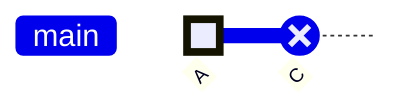

## 問題情境

部落格用 Hugo + Mermaid 10.6.1 畫 gitGraph，文章裡寫了 `type: HIGHLIGHT` 和 `type: REVERSE` 想標出特定 commit、但渲染出來全部是預設灰色，type 標記沒生效。

### 範例



期望：HIGHLIGHT 綠色、REVERSE 紅色  
實際：兩個都跟普通 commit 一樣灰

---

## 根本原因

`layouts/partials/custom_head.html` 的 `mermaid.initialize()` 裡 `themeVariables` 只設了通用顏色（`primaryColor`、`secondaryColor` 等），沒給 gitGraph 專用的顏色變數。Mermaid 找不到 HIGHLIGHT / REVERSE 對應的顏色就 fallback 到預設值。

```javascript
// 原本的配置（不完整）
themeVariables: {
  primaryColor: '#2d3748',
  primaryTextColor: '#2d3748',
  primaryBorderColor: '#4a5568',
  lineColor: '#4a5568',
  secondaryColor: '#e2e8f0',
  tertiaryColor: '#f7fafc'
  // ❌ 沒有 git0 / git1 / git2
}
```

---

## 解法

兩層補洞：JS 層補 themeVariables、CSS 層補 selector 規則做雙保險。

### 1. themeVariables 加 gitGraph 顏色

```javascript
themeVariables: {
  // 原本的通用顏色保留
  // ...

  // 補 gitGraph 顏色
  git0: '#90ee90',    // HIGHLIGHT
  git1: '#ffb6c6',    // REVERSE
  git2: '#4a5568'     // 其他
}
```

### 2. CSS selector 補強

光靠 themeVariables 在某些 Mermaid 版本仍不穩定，加 CSS 直接針對渲染後的 SVG 元素：

```css
.mermaid svg [id$="_HIGHLIGHT"] circle {
  fill: #90ee90;
  stroke: #2d7a2d;
}

.mermaid svg [id$="_REVERSE"] circle {
  fill: #ffb6c6;
  stroke: #d32f2f;
}
```

Mermaid 渲染 gitGraph 時、會在每個 commit 的 SVG node 加上 `id="..._HIGHLIGHT"` / `id="..._REVERSE"`，用 attribute selector `[id$="_TYPENAME"]` 命中。

---

## 注意事項

- **顏色變數命名隨 Mermaid 版本變動**：10.6.1 用 `git0` / `git1` / `git2`，更早版本可能是 `gitInv0` / `gitInv1`。升級 Mermaid 版本時要驗證一次。
- **CSS selector 是防禦性的**：themeVariables 配對的話 CSS 不會生效，但 themeVariables 失靈時 CSS 接住。雙保險。
- **修配置不能修語意問題**：這次的修復解決的是「顏色沒出來」這個視覺問題，但這篇文章引用 gitGraph 的其他事件中發現「用 emoji 圖例區分 HIGHLIGHT / REVERSE」本身是語意混淆 — 那個議題見 [report #92](/report/visual-tool-error-layer-alignment/)。

---

## 驗證

修改後在本地 Hugo dev server 預覽包含 gitGraph 的文章，確認：

- HIGHLIGHT 的 commit circle 顯示綠色
- REVERSE 的 commit circle 顯示紅色
- 沒有 type 的 commit 維持預設灰色
